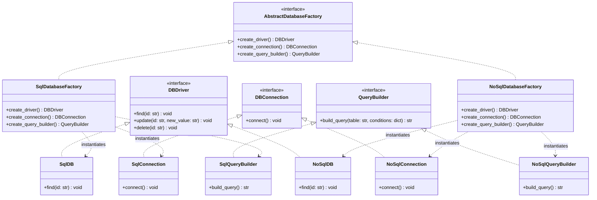

# Abstract Factory Pattern

The **Abstract Factory Pattern** is a creational design pattern that allows you to produce families of related or dependent objects without specifying their concrete classes. 

It is a step above the **Factory Method** pattern. Instead of managing the instantiation of a single product, the Abstract Factory manages a suite/family of related products (e.g., Database Driver, Connection, and Query Builder).

---

## Pattern Overview

In this example, we build upon the database driver concept from the [Factory Pattern](file:///D:/distributed-crawler/lld/factory/README.md) to instantiate a full **Database Stack Family** (SQL or NoSQL).

Each family requires a compatible set of products:
1. **Database Driver** (reused from [DBfactory.py](file:///D:/distributed-crawler/lld/factory/DBfactory.py))
2. **Database Connection** ([db_connection.py](file:///D:/distributed-crawler/lld/abstract_factory/db_connection.py))
3. **Database Query Builder** ([query_builder.py](file:///D:/distributed-crawler/lld/abstract_factory/query_builder.py))

### Participants

1. **Abstract Factory** ([AbstractDatabaseFactory](file:///D:/distributed-crawler/lld/abstract_factory/db_factory.py#L12)): Declares an interface for operations that create abstract product objects.
2. **Concrete Factories** ([SqlDatabaseFactory](file:///D:/distributed-crawler/lld/abstract_factory/db_factory.py#L32) & [NoSqlDatabaseFactory](file:///D:/distributed-crawler/lld/abstract_factory/db_factory.py#L49)): Implement the operations to build concrete products belonging to their respective families.
3. **Abstract Products** ([DBDriver](file:///D:/distributed-crawler/lld/factory/DBfactory.py#L4), [DBConnection](file:///D:/distributed-crawler/lld/abstract_factory/db_connection.py#L3), and [QueryBuilder](file:///D:/distributed-crawler/lld/abstract_factory/query_builder.py#L3)): Declare interfaces for a type of product object.
4. **Concrete Products**: Implement their abstract interfaces for a specific family:
   - **SQL Family**: `SqlDB`, `SqlConnection`, and `SqlQueryBuilder`.
   - **NoSQL Family**: `NoSqlDB`, `NoSqlConnection`, and `NoSqlQueryBuilder`.
5. **Client** ([main.py](file:///D:/distributed-crawler/lld/abstract_factory/main.py)): Uses only interfaces declared by Abstract Factory and Abstract Product classes.

---

## Architecture & Class Diagram

The following Mermaid diagram shows the relationship between our classes:



---

## Key Benefits

- **Consistency Among Products**: You are assured that the products you get from a factory are compatible with one another (e.g., you won't accidentally mix an SQL connection with a NoSQL query builder).
- **Loose Coupling**: Avoid tight coupling between concrete products and the client code.
- **Single Responsibility Principle**: You can extract the product creation code into one place, making the code easier to maintain.
- **Open/Closed Principle**: You can introduce new variants of products/families without breaking existing client code.

---

## How to Run the Example

Run the main file from the root directory of the workspace:

```bash
python abstract_factory/main.py
```
