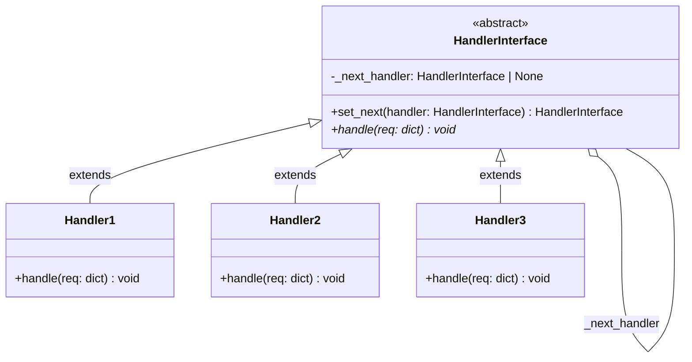
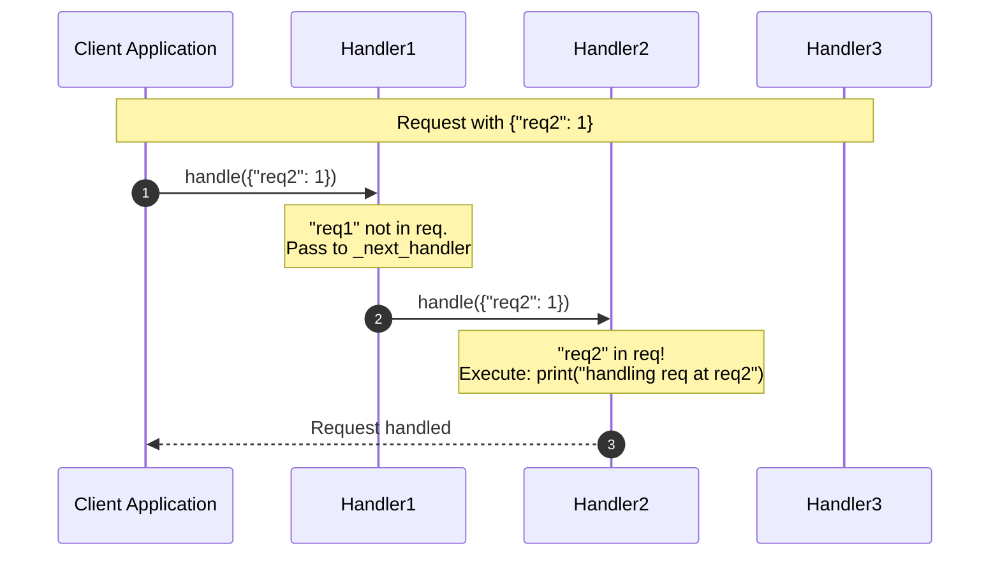

# Chain of Responsibility Design Pattern - Learning & Revision Guide

The **Chain of Responsibility** is a behavioral design pattern that lets you pass requests along a dynamic chain of handlers. Upon receiving a request, each handler decides either to process the request or to pass it to the next handler in the chain.

---

## 💡 Core Concept

Think of an **automated corporate customer support hotline**:
1. You call support and first speak to an **Automated Interactive Voice Response (IVR)**. If you need basic account balance info, it handles it immediately.
2. If your request is more complex, the IVR forwards you to a **Tier 1 Customer Representative**.
3. If Tier 1 cannot resolve your issue (e.g. an account security breach), they escalate you to a **Tier 2 Technical Specialist**.
4. If no one can handle it, an unhandled resolution message is returned.

> [!NOTE]
> **Key Rule of Thumb:** 
> - Decouple the **sender** of a request from its **receivers** by giving multiple objects a chance to handle the request.
> - Handlers can form a linear linked-list structure, and can stop propagation or continue passing the request down the chain.

---

## 🛠️ The Problem & Solution

### The Problem (Monolithic Conditional Blocks)
Suppose you are designing an order validation system or request processor. You need to perform several checks or dispatch tasks: authentication, rate limiting, schema validation, authorization, and caching.
- If implemented in a single function:
  ```python
  def process_request(request):
      if is_auth_request(request):
          # 50 lines of auth logic
      elif is_rate_limit_check(request):
          # 40 lines of rate limit logic
      elif is_validation_request(request):
          # ...
  ```
  This creates a gigantic, fragile function that violates the **Single Responsibility Principle** and **Open-Closed Principle**. Adding a new check or changing the ordering requires modifying this monolithic code, risking regressions.

### The Solution (Linked Chain of Handlers)
1. Define a common handler interface ([HandlerInterface](file:///D:/distributed-crawler/lld/behavioral/chain%20of%20responsibility/handlers.py#L4)) declaring `handle(req)` and `set_next(handler)`.
2. Extract each check into its own standalone class ([Handler1](file:///D:/distributed-crawler/lld/behavioral/chain%20of%20responsibility/handlers.py#L17), [Handler2](file:///D:/distributed-crawler/lld/behavioral/chain%20of%20responsibility/handlers.py#L27), [Handler3](file:///D:/distributed-crawler/lld/behavioral/chain%20of%20responsibility/handlers.py#L37)).
3. Link the handlers together at runtime: `h1.set_next(h2).set_next(h3)`.
4. The client submits requests to the first handler in the chain. The request travels until a handler handles it (or the end is reached).

---

## 📊 Design & Architecture

### UML Class Diagram



### Sequence Flow Diagram



---

## 🔍 Code Walkthrough

The implementation is found in [handlers.py](file:///D:/distributed-crawler/lld/behavioral/chain%20of%20responsibility/handlers.py):

1. **Handler Interface**: [HandlerInterface](file:///D:/distributed-crawler/lld/behavioral/chain%20of%20responsibility/handlers.py#L4)
   - Initializes `_next_handler = None`.
   - [set_next()](file:///D:/distributed-crawler/lld/behavioral/chain%20of%20responsibility/handlers.py#L9): Stores the reference to the next handler and returns that handler, allowing fluent chaining (`h1.set_next(h2).set_next(h3)`).
   - [handle()](file:///D:/distributed-crawler/lld/behavioral/chain%20of%20responsibility/handlers.py#L14): Abstract method to be implemented by concrete handlers.

2. **Concrete Handlers**:
   - [Handler1](file:///D:/distributed-crawler/lld/behavioral/chain%20of%20responsibility/handlers.py#L17): Checks if `"req1"` exists in the dictionary. If so, it processes it; otherwise, passes it to `_next_handler`.
   - [Handler2](file:///D:/distributed-crawler/lld/behavioral/chain%20of%20responsibility/handlers.py#L27): Checks for `"req2"`. Delegates to next if absent.
   - [Handler3](file:///D:/distributed-crawler/lld/behavioral/chain%20of%20responsibility/handlers.py#L37): Checks for `"req3"`. If not present and no next handler exists, outputs `"Request unhandled at the end of the chain"`.

3. **Client Execution**: [main.py](file:///D:/distributed-crawler/lld/behavioral/chain%20of%20responsibility/main.py#L13)
   Constructs the chain and fires multiple request payloads.

---

## 💻 Example Usage Code

From [main.py](file:///D:/distributed-crawler/lld/behavioral/chain%20of%20responsibility/main.py):

```python
from handlers import Handler1, Handler2, Handler3

if __name__ == "__main__":
    # 1. Instantiate handlers
    h1 = Handler1()
    h2 = Handler2()
    h3 = Handler3()

    # 2. Assemble the chain via method chaining
    h1.set_next(h2).set_next(h3)

    # 3. Dispatch requests
    print("--- Test 1 ---")
    h1.handle({"req1": 1})

    print("--- Test 2 ---")
    h1.handle({"req2": 1})

    print("--- Test 3 ---")
    h1.handle({"req3": 1})

    print("--- Test 4 (Unhandled) ---")
    h1.handle({"req4": 1})
```

### Expected Output
```text
--- Test 1 ---
handling req at req1
--- Test 2 ---
handling req at req2
--- Test 3 ---
handling req at req3
--- Test 4 (Unhandled) ---
Request unhandled at the end of the chain
```

---

## 🧠 Revision Cheat-Sheet

> [!TIP]
> Use Chain of Responsibility when more than one object can handle a request and the handler isn't known a priori, or when you want to execute multiple handlers in a strict dynamic order.

### 🌟 Key Design Principles Met
1. **Single Responsibility Principle (SRP):** You isolate the triggering logic from the concrete handling behaviors. Each handler only focuses on its specific responsibility.
2. **Open-Closed Principle (OCP):** You can introduce new handlers anywhere into the chain without modifying existing handler code or the client.
3. **Loose Coupling:** The client only interacts with the head of the chain; it doesn't need to know which specific handler eventually handles the request.

### ⚖️ Trade-offs
| Pros ✅ | Cons ❌ |
| :--- | :--- |
| **Control of Handling Order:** Handlers can be linked in any custom sequence dynamically at runtime. | **No Guarantee of Handling:** A request might fall off the end of the chain without ever being processed. |
| **Single Responsibility:** Divides monolithic conditional logic into clean, testable classes. | **Debugging Overhead:** Tracing execution across long chains can be tricky to debug. |
| **Dynamic Configuration:** Handlers can be added, removed, or reordered dynamically. | **Performance Latency:** Passing through deep chains can introduce slight latency overhead. |

### 🛠️ Real-world Examples
- **Web Framework Middleware:** Express.js `(req, res, next)`, Django/FastAPI HTTP middleware pipelines processing auth, CORS, compression, and session cookies.
- **Logging Pipelines:** Loggers passing messages down log level handlers (`DEBUG` -> `INFO` -> `WARNING` -> `ERROR`).
- **UI Event Bubbling:** In DOM/GUI frameworks, a click event travels from button to panel to window until handled.

---

## ❓ Frequently Asked Interview Questions

1. **What is the difference between Chain of Responsibility and Decorator Pattern?**
   - **Chain of Responsibility:** Handlers can stop the execution flow at any point (consume the request) and not pass it further. They are typically used for dispatching/routing.
   - **Decorator:** Decorators always pass execution through the entire wrapped hierarchy, adding behavior to the core result.

2. **Can a request be handled by multiple handlers in the chain?**
   - Yes! There are two variations:
     - *Pure CoR:* Exactly one handler processes the request and halts propagation.
     - *Filter / Interceptor Chain:* Each handler performs a task (e.g. logging, auth) and explicitly passes the request to the next handler.

3. **How do you prevent cyclic references in the chain?**
   - Chains should ideally be built via a Builder or configuration factory, or handlers can maintain a set of visited node IDs to guard against infinite recursion.

---

## 🚀 How to Run the Example

Run the main file from the workspace root:

```bash
python "behavioral/chain of responsibility/main.py"
```
