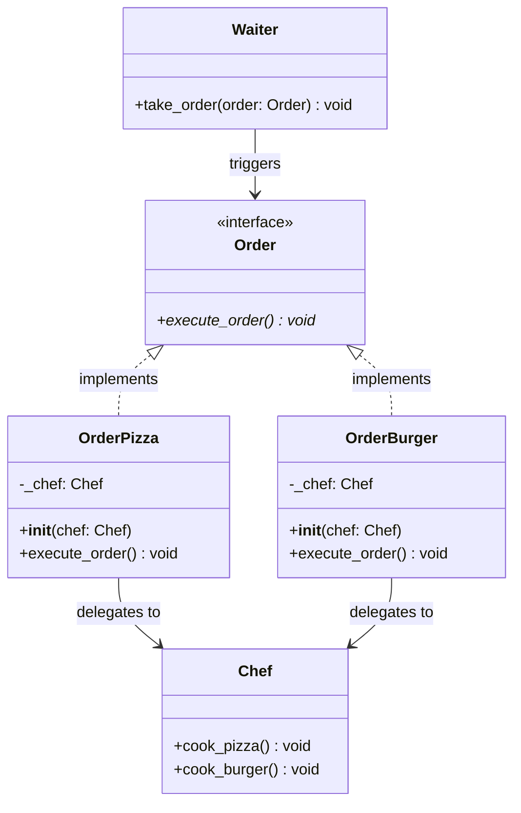
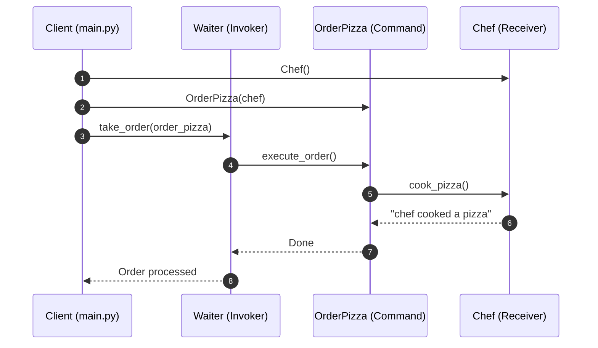

# Command Design Pattern - Learning & Revision Guide

The **Command Pattern** is a behavioral design pattern that encapsulates a request or action as a standalone object. This transformation allows you to parameterize clients with different requests, queue or log requests, pass commands across threads, and support undoable operations.

---

## 💡 Core Concept

Think of a **restaurant dining experience**:
1. You (the **Client**) tell the waiter you want a pizza and a burger.
2. The waiter (the **Invoker**) doesn't cook your food. Instead, the waiter writes down each item on an order slip (the **Command**).
3. The order slip contains all necessary information and binds the request to the kitchen chef (the **Receiver**).
4. The waiter places the order slips into the kitchen queue. When ready, the chef reads the slip and executes the specific cooking action (`cook_pizza()`, `cook_burger()`).

> [!NOTE]
> **Key Rule of Thumb:** 
> - **Command** turns a method call into an object.
> - Decouples the **Invoker** (who triggers the action) from the **Receiver** (who knows how to execute the business logic).

---

## 🛠️ The Problem & Solution

### The Problem (Tight Coupling Between Trigger and Execution)
Imagine creating a UI button or a network request handler:
- If a button calls the database or printer directly (`button.click() -> db.save()`), you tightly couple the UI layer with backend logic.
- If you have multiple buttons or shortcuts performing the same action (e.g., Save from menu, toolbar icon, and `Ctrl+S`), you duplicate execution logic everywhere.
- You cannot easily implement features like:
  - **Undo / Redo** history.
  - **Command Queues / Schedulers** (running commands in background workers).
  - **Audit Logging** (recording every operation executed).

### The Solution (Encapsulated Command Objects)
1. Declare a common command interface ([Order](file:///D:/distributed-crawler/lld/behavioral/command/order.py#L3)) with an `execute_order()` method.
2. For each action, create a concrete command class ([OrderPizza](file:///D:/distributed-crawler/lld/behavioral/command/order_pizza.py#L4), [OrderBurger](file:///D:/distributed-crawler/lld/behavioral/command/order_burger.py#L4)) that holds a reference to the [Chef](file:///D:/distributed-crawler/lld/behavioral/command/chef.py#L1) (Receiver).
3. The [Waiter](file:///D:/distributed-crawler/lld/behavioral/command/waiter.py#L3) (Invoker) accepts any `Order` object and simply calls `order.execute_order()`. The Waiter does not know or care how a pizza is prepared.

---

## 📊 Design & Architecture

### UML Class Diagram



### Sequence Flow Diagram



---

## 🔍 Code Walkthrough

The implementation is cleanly separated across files:

1. **Command Interface**: [Order](file:///D:/distributed-crawler/lld/behavioral/command/order.py#L3)
   Defines the abstract method `execute_order()`.
2. **The Receiver**: [Chef](file:///D:/distributed-crawler/lld/behavioral/command/chef.py#L1)
   The class containing actual domain execution logic:
   - `cook_pizza()`: prints cooking confirmation.
   - `cook_burger()`: prints cooking confirmation.
3. **Concrete Commands**:
   - [OrderPizza](file:///D:/distributed-crawler/lld/behavioral/command/order_pizza.py#L4): Stores `_chef` and implements `execute_order()` by calling `self._chef.cook_pizza()`.
   - [OrderBurger](file:///D:/distributed-crawler/lld/behavioral/command/order_burger.py#L4): Stores `_chef` and implements `execute_order()` by calling `self._chef.cook_burger()`.
4. **The Invoker**: [Waiter](file:///D:/distributed-crawler/lld/behavioral/command/waiter.py#L3)
   Maintains no knowledge of food preparation. When `take_order(order: Order)` is called, it triggers `order.execute_order()`.
5. **The Client**: [main.py](file:///D:/distributed-crawler/lld/behavioral/command/main.py#L39)
   Creates the Receiver, packages requests into Command instances, and hands them to the Waiter.

---

## 💻 Example Usage Code

From [main.py](file:///D:/distributed-crawler/lld/behavioral/command/main.py):

```python
from waiter import Waiter 
from chef import Chef
from order_pizza import OrderPizza
from order_burger import OrderBurger

if __name__ == "__main__":
    # 1. Receiver
    chef = Chef()

    # 2. Invoker
    waiter = Waiter()

    # 3. Create command objects binding Receiver to actions
    pizza_order = OrderPizza(chef)
    burger_order = OrderBurger(chef)

    # 4. Trigger execution through the invoker
    print("--- Taking Orders ---")
    waiter.take_order(pizza_order)
    waiter.take_order(burger_order)
```

### Expected Output
```text
--- Taking Orders ---
chef cooked a pizza
chef cooked a burger
```

---

## 🧠 Revision Cheat-Sheet

> [!TIP]
> Use Command when you need to parameterize objects with operations, queue operations, schedule their execution, or support reversible operations (undo/redo).

### 🌟 Key Design Principles Met
1. **Single Responsibility Principle (SRP):** Classes invoking operations (UI/Invoker) are decoupled from classes that perform operations (Receiver).
2. **Open-Closed Principle (OCP):** You can introduce new commands (e.g. `OrderPasta`) without modifying existing waiter, chef, or client code.
3. **High Cohesion:** Each command class encapsulates only one specific operation.

### ⚖️ Trade-offs
| Pros ✅ | Cons ❌ |
| :--- | :--- |
| **Complete Decoupling:** The invoker knows nothing about the receiver's API. | **Class Proliferation:** Every distinct operation requires creating a separate concrete command class. |
| **First-Class Objects:** Commands can be passed around, serialized, queued, delayed, or logged. | **Layer of Indirection:** Additional objects and method hops between client and receiver. |
| **Enables Undo/Redo:** By storing previous state inside the command, you can easily implement an `undo()` method. | **Design Complexity:** Overkill for simple, direct method calls. |

### 🛠️ Real-world Examples
- **GUI Buttons and Menu Items:** GUI toolkits (Tkinter, Qt, React action dispatchers) where buttons accept command handlers.
- **Transactional Task Queues:** Celery / RabbitMQ background task jobs (each job encapsulates function name, receiver, and arguments).
- **Text Editor Undo Stacks:** Storing a history of executed command objects (e.g., `InsertTextCommand`, `DeleteTextCommand`).

---

## ❓ Frequently Asked Interview Questions

1. **How do you implement Undo/Redo using the Command Pattern?**
   - Add an `undo()` method to the `Order` interface.
   - The concrete command stores the previous state before modifying the receiver.
   - The Invoker maintains an undo stack: when undo is requested, it pops the last command and calls `command.undo()`.

2. **What is the difference between Command Pattern and Strategy Pattern?**
   - **Command:** Encapsulates a *specific request/action* to be executed at a specific time (often with lifecycle, undo, or queuing).
   - **Strategy:** Encapsulates an *algorithm* for doing something (e.g., different ways to sort a list or calculate tax) and is usually executed immediately.

3. **Can a Command object be executed asynchronously?**
   - Yes! Because the command packages all data and dependencies into an object, it can be put into an asynchronous queue and executed by a worker pool at any future time.

---

## 🚀 How to Run the Example

Run the main file from the workspace root:

```bash
python behavioral/command/main.py
```
