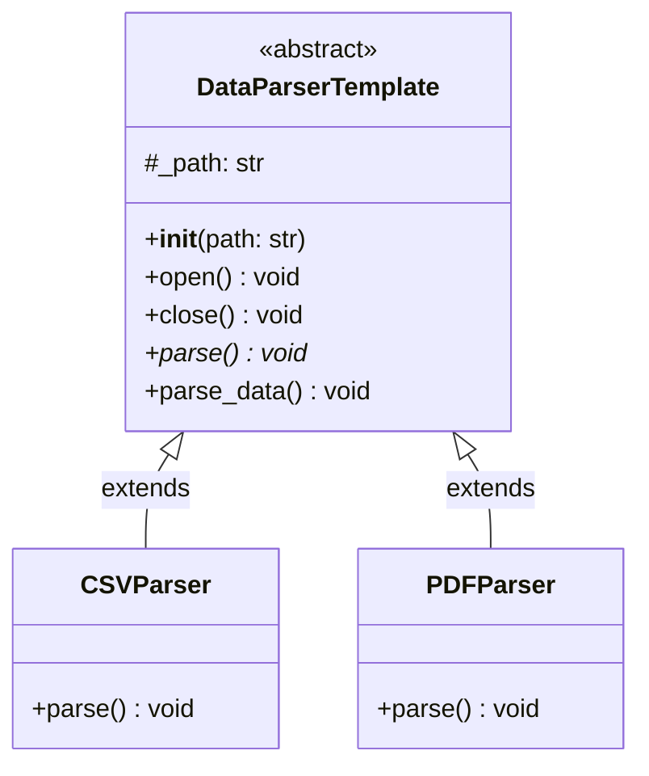
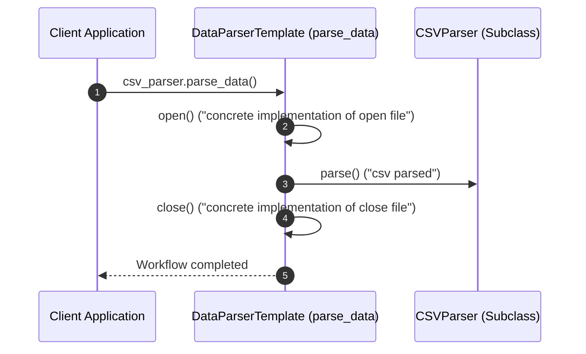

# Template Method Design Pattern - Learning & Revision Guide

The **Template Method Pattern** is a behavioral design pattern that defines the skeleton of an algorithm in an abstract base class, deferring some specific steps to subclasses. It allows subclasses to redefine certain steps of an algorithm without changing the algorithm's overarching structure.

---

## 💡 Core Concept

Think of **building a prefabricated house**:
1. Every house construction follows a strict sequence:
   - **Step 1:** Lay the foundation.
   - **Step 2:** Build the frame & walls.
   - **Step 3:** Install plumbing & electricals.
   - **Step 4:** Paint and furnish the interior.
2. The architectural blueprint (the **Template Method**) fixes the exact sequence of steps.
3. However, whether the walls are made of **Wood**, **Brick**, or **Glass** is left to the homeowner / contractor (the **Subclasses**). The sequence never changes, but individual steps can be customized.

> [!NOTE]
> **The Hollywood Principle:**
> *"Don't call us, we'll call you."*
> In Template Method, high-level parent classes control the algorithm flow and call methods implemented in low-level subclasses—inverting the traditional control flow.

---

## 🛠️ The Problem & Solution

### The Problem (Duplicated Algorithm Skeletons)
Suppose you are building data parsers for different document types: CSV, PDF, JSON, XML.
- All parsers share the exact same operational lifecycle:
  1. Open the file on disk.
  2. Read and parse the raw contents into memory.
  3. Close the file and clean up system resources.
- If you write independent `CSVParser` and `PDFParser` classes without a template:
  - `open()` and `close()` logic is duplicated in every class.
  - If a developer forgets to call `close()`, file handles leak.
  - If the general parsing workflow changes (e.g. adding a security validation step), you must update every parser class in the codebase.

### The Solution (Template Method in Abstract Base Class)
1. Create an abstract base class ([DataParserTemplate](file:///D:/distributed-crawler/lld/behavioral/template/template.py#L14)) containing:
   - Shared concrete operations: `open()` and `close()`.
   - An abstract primitive operation: `parse()`.
   - The **Template Method**: `parse_data()` which coordinates the exact order:
     ```python
     def parse_data(self):
         self.open()
         self.parse()
         self.close()
     ```
2. Concrete subclasses ([CSVParser](file:///D:/distributed-crawler/lld/behavioral/template/template.py#L56), [PDFParser](file:///D:/distributed-crawler/lld/behavioral/template/template.py#L64)) inherit from `DataParserTemplate` and implement *only* the `parse()` step.

---

## 📊 Design & Architecture

### UML Class Diagram



### Execution Flow Diagram



---

## 🔍 Code Walkthrough

The implementation in [template.py](file:///D:/distributed-crawler/lld/behavioral/template/template.py) contains:

1. **Abstract Template Class**: [DataParserTemplate](file:///D:/distributed-crawler/lld/behavioral/template/template.py#L14)
   - [__init__(path: str)](file:///D:/distributed-crawler/lld/behavioral/template/template.py#L23): Stores file path.
   - [open()](file:///D:/distributed-crawler/lld/behavioral/template/template.py#L34): Concrete shared file open logic.
   - [close()](file:///D:/distributed-crawler/lld/behavioral/template/template.py#L40): Concrete shared cleanup logic.
   - [parse()](file:///D:/distributed-crawler/lld/behavioral/template/template.py#L27): Abstract primitive operation to be filled in by subclasses.
   - [parse_data()](file:///D:/distributed-crawler/lld/behavioral/template/template.py#L46): The **Template Method** defining the sequence `self.open() -> self.parse() -> self.close()`.
2. **Concrete Subclasses**:
   - [CSVParser](file:///D:/distributed-crawler/lld/behavioral/template/template.py#L56): Implements CSV parsing.
   - [PDFParser](file:///D:/distributed-crawler/lld/behavioral/template/template.py#L64): Implements PDF parsing.
3. **Execution Demonstration**: [main](file:///D:/distributed-crawler/lld/behavioral/template/template.py#L72)
   Executes both parsers by invoking `parse_data()`.

---

## 💻 Example Usage Code

From [template.py](file:///D:/distributed-crawler/lld/behavioral/template/template.py#L72):

```python
from template import CSVParser, PDFParser

if __name__ == "__main__":
    print("--- Running CSV Parser ---")
    csv_parser = CSVParser("document.csv")
    csv_parser.parse_data()

    print("\n--- Running PDF Parser ---")
    pdf_parser = PDFParser("document.pdf")
    pdf_parser.parse_data()
```

### Expected Output
```text
--- Running CSV Parser ---
concrete implementation of open file: document.csv
csv parsed
concrete implementation of close file: document.csv

--- Running PDF Parser ---
concrete implementation of open file: document.pdf
pdf parsed
concrete implementation of close file: document.pdf
```

---

## 🧠 Revision Cheat-Sheet

> [!TIP]
> Use Template Method when you want clients to extend only particular steps of an algorithm, but not the entire algorithm or its structure.

### 🌟 Key Design Principles Met
1. **DRY (Don't Repeat Yourself):** Pulls common boilerplate code up to a shared superclass.
2. **Inversion of Control (Hollywood Principle):** Superclass calls the subclass methods, not vice versa.
3. **Open-Closed Principle (OCP):** Subclasses can introduce new step variations without altering the template method.

### ⚖️ Trade-offs
| Pros ✅ | Cons ❌ |
| :--- | :--- |
| **Code Reuse:** Eliminates boilerplate by sharing the algorithm skeleton across all subclasses. | **Rigidity:** Subclasses are strictly bound to the execution order prescribed by the superclass. |
| **Control of Invariants:** Ensures critical pre-requisite and cleanup steps (like closing resources) are never missed. | **Inheritance Pitfall:** Relies on class inheritance, which can violate Liskov Substitution Principle if subclasses fail to conform to expected step invariants. |
| **Subclass Simplicity:** Subclasses only implement their domain-specific step, ignoring orchestrating logic. | **Maintenance Fragility:** Changing the sequence in the template method affects every subclass across the codebase. |

### 🛠️ Real-world Examples
- **Unit Testing Frameworks:** `unittest.TestCase` where the test runner calls `setUp()` -> `test_method()` -> `tearDown()`.
- **Django Web Framework:** Class-Based Generic Views (`View.dispatch()` -> `get()` / `post()`).
- **Data ETL Pipelines:** Extract -> Transform -> Load pipelines where Extract and Load are standard, but Transform varies per data source.

---

## ❓ Frequently Asked Interview Questions

1. **What is the difference between Template Method and Strategy Pattern?**
   - **Template Method** uses *inheritance*: the algorithm skeleton is in the superclass, and subclasses override specific steps. The structure is fixed at compile-time.
   - **Strategy** uses *composition*: the entire algorithm is encapsulated in a separate strategy object, which can be swapped at runtime.

2. **What are "Hook Methods" in Template Method?**
   - A **Hook** is a method in the base class with a default (often empty) implementation. Subclasses can optionally override it to "hook into" the algorithm at crucial points, but are not forced to (unlike abstract methods).

3. **How do you prevent subclasses from overriding the Template Method itself?**
   - In languages like Java or C++, mark the template method `final`. In Python, you can enforce this via convention, docstrings, or a custom metaclass that raises an error if `parse_data` is overridden in subclasses.

---

## 🚀 How to Run the Example

Run the script from the workspace root:

```bash
python behavioral/template/template.py
```
