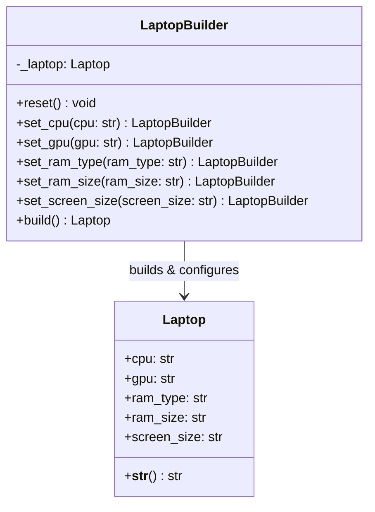

# Builder Pattern

The **Builder Pattern** is a creational design pattern that allows you to construct complex objects step-by-step. Unlike other creational patterns, Builder does not require products to have a common interface or conform to a strict template. It allows you to produce different types and representations of an object using the same construction code.

---

## Pattern Overview

When an object requires many optional parameters or configurations, creating it using a standard constructor can lead to a "telescoping constructor" anti-pattern (where you have a large number of parameters, many of which are optional or default to `None` or null values).

The Builder Pattern addresses this by:
1. Encapsulating the construction code of the product out of the product class itself.
2. Providing builder methods (setters) that can be chained together (by returning the builder instance `self`).
3. Providing a clean `build()` method to retrieve the finalized product.

### Participants

1. **Product** ([Laptop](file:///D:/distributed-crawler/lld/builder/laptop.py)): The complex object being constructed. It contains various specifications/attributes (CPU, GPU, RAM, screen size, etc.).
2. **Builder** ([LaptopBuilder](file:///D:/distributed-crawler/lld/builder/laptop_builder.py)): The interface/concrete class responsible for creating the parts of the Product object. It contains setter methods for each configuration parameter and a `build()` method to return the final Product.
3. **Client** ([main.py](file:///D:/distributed-crawler/lld/builder/main.py)): Configures the builder and triggers the build process to instantiate custom variations of the Product.

---

## Architecture & Class Diagram

The following Mermaid diagram shows the relationship between our classes:



### Flow of Execution

1. The **Client** ([main.py](file:///D:/distributed-crawler/lld/builder/main.py)) instantiates the **Builder** ([LaptopBuilder](file:///D:/distributed-crawler/lld/builder/laptop_builder.py)).
2. The **Client** configures the product step-by-step using **method chaining** (e.g., `.set_cpu("Intel Core i7").set_gpu("NVIDIA RTX 4070")`).
3. The **Client** calls `.build()` on the builder.
4. The **Builder** returns the fully constructed [Laptop](file:///D:/distributed-crawler/lld/builder/laptop.py) object and resets its internal state so it is ready to build another product.
5. The **Client** uses or prints the finalized product object.

---

## Key Benefits

- **Step-by-Step Construction**: You can defer construction steps or run steps recursively.
- **Supports Method Chaining**: Cleaner syntax compared to multiple setters on separate lines or passing long lists of optional arguments to a single constructor.
- **Single Responsibility Principle**: You isolate complex construction code from the business logic of the product itself.
- **Product Immutability / Clean State**: Since the builder constructs the object incrementally, the product class itself doesn't need to expose setters or mutable fields directly to the rest of the application, keeping state safer.

---

## How to Run the Example

Run the main file from the root directory of the workspace:

```bash
python builder/main.py
```
