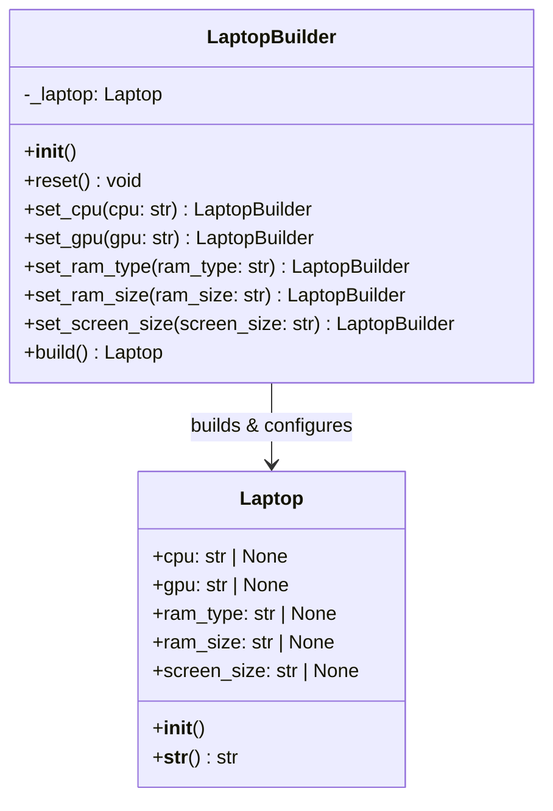
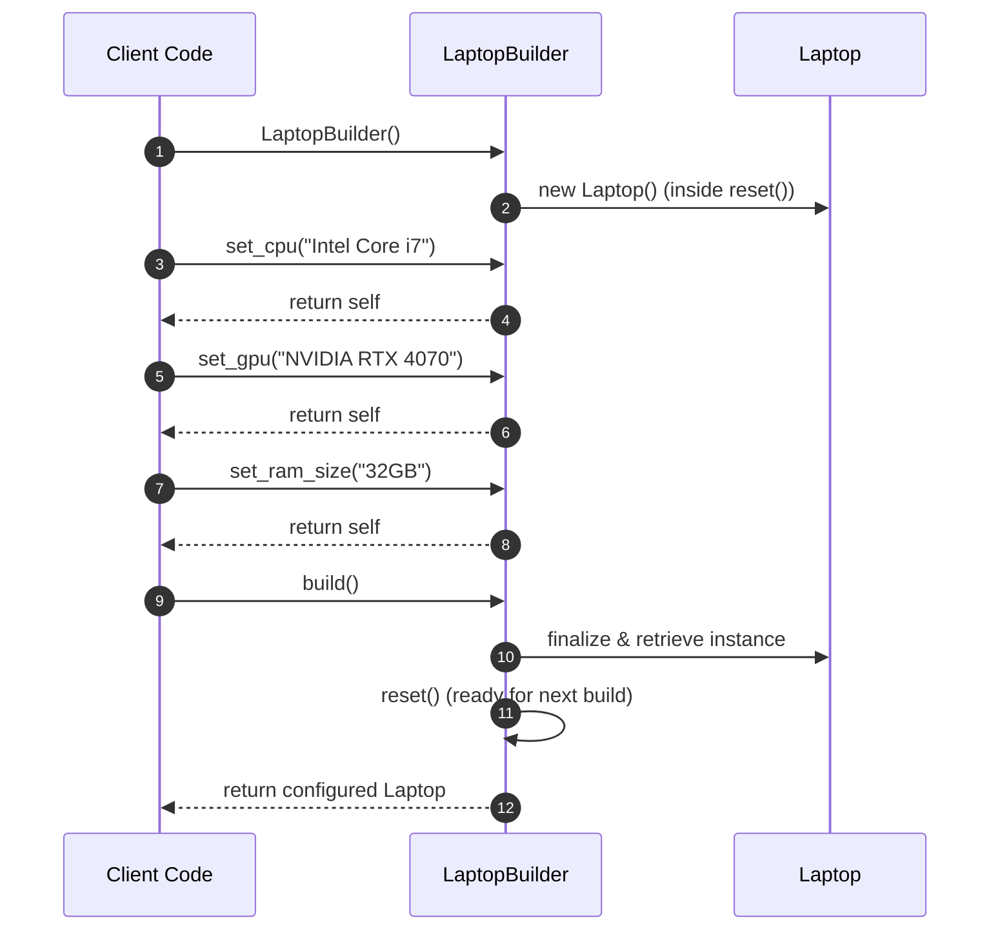

# Builder Design Pattern - Learning & Revision Guide

The **Builder Pattern** is a creational design pattern that lets you construct complex objects step-by-step. It allows you to produce different types and representations of an object using the same construction process, avoiding bloated telescoping constructors.

---

## 💡 Core Concept

Think of building a **custom assembled PC or ordering a custom sandwich**:
- At Subway, you don't order by reciting a 30-parameter list: `Sandwich("Wheat", "Footlong", "Turkey", None, "Cheddar", True, False, ...)`
- Instead, you assemble it step-by-step: choose bread, choose protein, choose cheese, add toasted flag, choose sauces, and finally say "Pack it up" (`build()`).

> [!NOTE]
> **Key Rule of Thumb:** 
> - Use Builder when an object has **many optional parameters**, complex validation rules, or multiple configuration representations.
> - Method chaining (fluent interface) is achieved by returning `self` from each builder setter method.

---

## 🛠️ The Problem & Solution

### The Problem (Telescoping Constructor Anti-Pattern)
Imagine a [Laptop](file:///D:/distributed-crawler/lld/builder/laptop.py#L1) class that needs specifications for CPU, GPU, RAM type, RAM size, storage type, screen size, battery capacity, keyboard layout, etc.
- **Telescoping Constructor**:
  ```python
  laptop = Laptop("Intel i7", "RTX 4070", "DDR5", "32GB", None, "15.6 inch", None, None)
  ```
  This leads to unreadable code, difficult maintenance, positional argument bugs (swapping two string parameters accidentally), and forcing callers to pass `None` for attributes they don't care about.
- **Direct Property Mutation**:
  Creating an empty object and manually setting properties (`laptop.cpu = ...`) leaves the object in a half-initialized, mutable, and inconsistent state during construction.

### The Solution (Fluent Builder Class)
Extract object construction logic into a dedicated [LaptopBuilder](file:///D:/distributed-crawler/lld/builder/laptop_builder.py#L3) class:
1. Each configuration step has a dedicated, expressive setter (`set_cpu`, `set_gpu`, etc.).
2. Each setter returns `self` to support readable **method chaining**.
3. A final [build()](file:///D:/distributed-crawler/lld/builder/laptop_builder.py#L31) method validates the state, retrieves the fully constructed product, and resets the builder for subsequent runs.

---

## 📊 Design & Architecture

### UML Class Diagram


```mermaid
classDiagram
    class Laptop {
        +cpu: str | None
        +gpu: str | None
        +ram_type: str | None
        +ram_size: str | None
        +screen_size: str | None
        +__init__()
        +__str__() str
    }

    class LaptopBuilder {
        -_laptop: Laptop
        +__init__()
        +reset() void
        +set_cpu(cpu: str) LaptopBuilder
        +set_gpu(gpu: str) LaptopBuilder
        +set_ram_type(ram_type: str) LaptopBuilder
        +set_ram_size(ram_size: str) LaptopBuilder
        +set_screen_size(screen_size: str) LaptopBuilder
        +build() Laptop
    }

    LaptopBuilder --> Laptop : builds & configures
```

### Sequence Flow Diagram


```mermaid
sequenceDiagram
    autonumber
    participant Client as Client Code
    participant Builder as LaptopBuilder
    participant Product as Laptop

    Client->>Builder: LaptopBuilder()
    Builder->>Product: new Laptop() (inside reset())
    Client->>Builder: set_cpu("Intel Core i7")
    Builder-->>Client: return self
    Client->>Builder: set_gpu("NVIDIA RTX 4070")
    Builder-->>Client: return self
    Client->>Builder: set_ram_size("32GB")
    Builder-->>Client: return self
    Client->>Builder: build()
    Builder->>Product: finalize & retrieve instance
    Builder->>Builder: reset() (ready for next build)
    Builder-->>Client: return configured Laptop
```

---

## 🔍 Code Walkthrough

The codebase contains:

1. **The Product**: [Laptop](file:///D:/distributed-crawler/lld/builder/laptop.py#L1)
   The complex object being created. It initializes with optional attributes and has a formatted `__str__` method to print its active specifications.
2. **The Builder**: [LaptopBuilder](file:///D:/distributed-crawler/lld/builder/laptop_builder.py#L3)
   Encapsulates the construction of the [Laptop](file:///D:/distributed-crawler/lld/builder/laptop.py#L1):
   - [reset()](file:///D:/distributed-crawler/lld/builder/laptop_builder.py#L8): Instantiates a fresh [Laptop](file:///D:/distributed-crawler/lld/builder/laptop.py#L1) instance.
   - [set_cpu()](file:///D:/distributed-crawler/lld/builder/laptop_builder.py#L11), [set_gpu()](file:///D:/distributed-crawler/lld/builder/laptop_builder.py#L15), [set_ram_type()](file:///D:/distributed-crawler/lld/builder/laptop_builder.py#L19), [set_ram_size()](file:///D:/distributed-crawler/lld/builder/laptop_builder.py#L23), [set_screen_size()](file:///D:/distributed-crawler/lld/builder/laptop_builder.py#L27): Fluent configuration methods returning `self`.
   - [build()](file:///D:/distributed-crawler/lld/builder/laptop_builder.py#L31): Returns the completed laptop and resets its internal reference for the next build cycle.
3. **The Client**: [main.py](file:///D:/distributed-crawler/lld/builder/main.py#L17)
   Constructs distinct product variations (Gaming vs Budget laptop) using method chaining.

---

## 💻 Example Usage Code

From [main.py](file:///D:/distributed-crawler/lld/builder/main.py):

```python
from laptop_builder import LaptopBuilder

if __name__ == "__main__":
    # 1. Building a high-end Gaming Laptop via method chaining
    gaming_laptop = (
        LaptopBuilder()
        .set_cpu("Intel Core i7")
        .set_gpu("NVIDIA RTX 4070")
        .set_ram_type("DDR5")
        .set_ram_size("32GB")
        .set_screen_size("15.6 inch")
        .build()
    )
    print(gaming_laptop)

    # 2. Building a Budget Laptop (leaving optional specs unset)
    budget_laptop = (
        LaptopBuilder()
        .set_cpu("Intel Core i3")
        .set_ram_size("8GB")
        .build()
    )
    print(budget_laptop)
```

### Expected Output
```text
--- Creating a Gaming Laptop via Builder Pattern ---
Laptop Specifications:
 - CPU: Intel Core i7
 - GPU: NVIDIA RTX 4070
 - RAM Type: DDR5
 - RAM Size: 32GB
 - Screen Size: 15.6 inch

--- Creating a Budget/Office Laptop with fewer custom specs ---
Laptop Specifications:
 - CPU: Intel Core i3
 - RAM Size: 8GB
```

---

## 🧠 Revision Cheat-Sheet

> [!TIP]
> Use the Builder Pattern when construction involves multiple steps, optional parts, or when you want to enforce immutability on the resulting product once built.

### 🌟 Key Design Principles Met
1. **Single Responsibility Principle (SRP):** Construction and initialization details are isolated into the builder, leaving the product clean and focused on business logic.
2. **Open-Closed Principle (OCP):** You can add new builder variations (or a `Director` class) to define standard configurations without altering product classes.
3. **Encapsulation of State:** Incomplete objects are never exposed to the client until `.build()` is invoked.

### ⚖️ Trade-offs
| Pros ✅ | Cons ❌ |
| :--- | :--- |
| **Step-by-step Construction:** Defer construction steps, run them conditionally, or chain them fluently. | **Increased Code Volume:** Requires writing a builder class with setters mirroring product fields. |
| **Reusability:** A single builder can build multiple representations or be reused across runs. | **Coupling to Product:** Any change to product attributes often requires updating the builder methods. |
| **Readable Client Code:** Fluent chaining avoids long positional argument lists and positional bugs. | **Overkill for Simple Objects:** Unnecessary if the object only has 1-2 mandatory parameters. |

### 🛠️ Real-world Examples
- **HTTP Request Builders:** Requests/Urllib clients building complex headers, auth, query params, and body (`RequestBuilder.url(...).header(...).body(...).send()`).
- **SQL Query Builders:** Libraries like SQLAlchemy Core or Knex (`query.select(...).where(...).orderBy(...)`).
- **Document Generators:** HTML/DOM builders or PDF report generators.

---

## ❓ Frequently Asked Interview Questions

1. **How is the Builder Pattern different from the Factory Pattern?**
   - **Factory** focuses on creating an object in a single shot, abstracting *which* subclass or variant is instantiated.
   - **Builder** focuses on constructing a complex object *step-by-step* through fine-grained configuration.

2. **What is a "Director" in the Builder pattern and when is it needed?**
   - A **Director** defines the sequence in which construction steps are called to produce common configurations (e.g. `Director.build_gaming_rig(builder)`). The Director is optional; the client can also invoke builder steps directly.

3. **How does Builder help with Object Immutability?**
   - The product class itself does not need public setters. The builder configures attributes during creation, and once `build()` returns the product, the object can remain completely immutable and thread-safe.

---

## 🚀 How to Run the Example

Run the main file from the workspace root:

```bash
python builder/main.py
```
