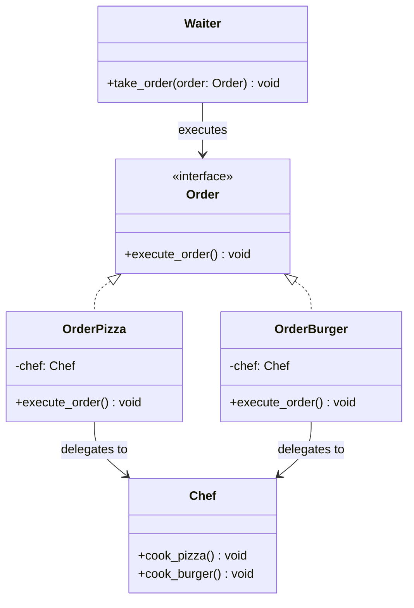

# Command Pattern

The **Command Pattern** is a behavioral design pattern that turns a request into a stand-alone object containing all information about the request. This transformation allows you to pass requests as method arguments, delay or queue a request's execution, and support undoable operations.

---

## Pattern Overview

The Command Pattern decouples the object that invokes the operation (the **Invoker**) from the one that knows how to perform it (the **Receiver**). 

### Participants

1. **Command** ([Order](file:///D:/distributed-crawler/lld/command/order.py)): Interface declaring the execution method (`execute_order`).
2. **Concrete Commands** ([OrderPizza](file:///D:/distributed-crawler/lld/command/order_pizza.py) & [OrderBurger](file:///D:/distributed-crawler/lld/command/order_burger.py)): Bind a Receiver to specific actions. Implement `execute_order` by calling corresponding operations on the Receiver.
3. **Receiver** ([Chef](file:///D:/distributed-crawler/lld/command/chef.py)): Knows how to perform the actual business logic or actions (e.g., `cook_pizza` and `cook_burger`).
4. **Invoker** ([Waiter](file:///D:/distributed-crawler/lld/command/waiter.py)): Triggers the command execution by calling `execute_order`. It does not know the details of concrete commands or the receiver.
5. **Client** ([main.py](file:///D:/distributed-crawler/lld/command/main.py)): Instantiates the Receiver, Concrete Commands, and Invoker, and connects them.

---

## Architecture & Class Diagram

The following Mermaid diagram shows the relationship between our classes:



### Flow of Execution

1. The **Client** ([main.py](file:///D:/distributed-crawler/lld/command/main.py)) instantiates the **Receiver** ([Chef](file:///D:/distributed-crawler/lld/command/chef.py)).
2. The **Client** instantiates one or more **Concrete Commands** (e.g., `OrderPizza`), passing the receiver as a constructor argument.
3. The **Client** passes the Command objects to the **Invoker** ([Waiter](file:///D:/distributed-crawler/lld/command/waiter.py)) via `take_order()`.
4. The **Invoker** executes the command by invoking its `execute_order()` method.
5. The **Concrete Command** delegates the work to its **Receiver** (`chef.cook_pizza()`).

---

## Key Benefits

- **Loose Coupling**: The `Waiter` class is completely decoupled from the `Chef` class. The `Waiter` only knows about the abstract `Order` interface.
- **Single Responsibility Principle**: You can decouple classes that invoke operations from classes that perform these operations.
- **Open/Closed Principle**: You can introduce new commands (e.g. `OrderSalad`) without breaking existing client or invoker code.

---

## How to Run the Example

Run the main file from the root directory of the workspace:

```bash
python command/main.py
```
