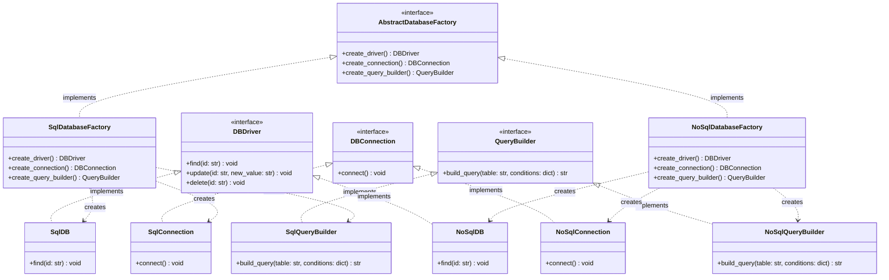
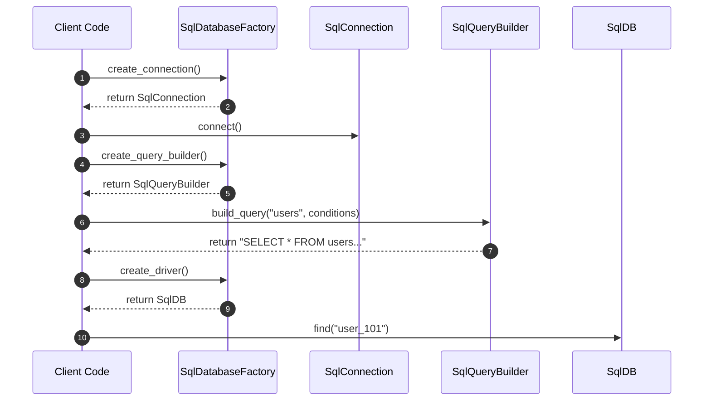

# Abstract Factory Design Pattern - Learning & Revision Guide

The **Abstract Factory Pattern** is a creational design pattern that lets you produce families of related or dependent objects without specifying their concrete classes. It provides an interface for creating families of related products, guaranteeing that the products you receive from a factory are always mutually compatible.

---

## 💡 Core Concept

Think of an Abstract Factory as a **"Factory of Factories"**. 

Imagine a furniture store producing furniture in distinct styles: *Modern*, *Victorian*, and *Art Deco*. You have individual products: *Chair*, *Sofa*, and *Coffee Table*.
- You don't want a Modern chair paired with a Victorian sofa in your living room—they clash!
- An Abstract Factory ensures you order from a specific family factory (e.g., `ModernFurnitureFactory`), guaranteeing every piece of furniture produced matches the Modern style.

> [!NOTE]
> **Key Rule of Thumb:** 
> - **Factory Method:** Creates **one** product via inheritance/method delegation.
> - **Abstract Factory:** Creates **families of related products** via object composition.

---

## 🛠️ The Problem & Solution

### The Problem (Incompatible Product Suites)
Suppose your application supports multiple database backends: **SQL** (relational) and **NoSQL** (document-based). Each database backend requires a compatible suite of products:
1. A **Database Driver** (e.g., `SqlDB` vs `NoSqlDB`)
2. A **Connection Manager** (e.g., `SqlConnection` vs `NoSqlConnection`)
3. A **Query Builder** (e.g., `SqlQueryBuilder` generating `SELECT * FROM ...` vs `NoSqlQueryBuilder` generating `db.collection.find(...)`)

If client code instantiates these products directly using `new` or individual simple factories, a client could mistakenly pair a `SqlConnection` with a `NoSqlQueryBuilder`. The resulting SQL engine cannot execute a MongoDB-style query, causing severe runtime errors.

### The Solution (Family Factory Interface)
Define an [AbstractDatabaseFactory](file:///D:/distributed-crawler/lld/creational/abstract%20factory/db_factory.py#L12) interface declaring creation methods for *every* product in the family:
- `create_driver() -> DBDriver`
- `create_connection() -> DBConnection`
- `create_query_builder() -> QueryBuilder`

Then create concrete factories ([SqlDatabaseFactory](file:///D:/distributed-crawler/lld/creational/abstract%20factory/db_factory.py#L36) and [NoSqlDatabaseFactory](file:///D:/distributed-crawler/lld/creational/abstract%20factory/db_factory.py#L54)). The client code only interacts with the abstract factory and abstract product interfaces. Switching from SQL to NoSQL requires passing a different factory instance, ensuring 100% product compatibility.

---

## 📊 Design & Architecture

### UML Class Diagram



### Sequence Flow Diagram



---

## 🔍 Code Walkthrough

The implementation is modularized across specialized files:

1. **Abstract Products**:
   - [DBConnection](file:///D:/distributed-crawler/lld/creational/abstract%20factory/db_connection.py#L3): Declares the interface for opening database connections via `connect()`.
   - [QueryBuilder](file:///D:/distributed-crawler/lld/creational/abstract%20factory/query_builder.py#L3): Declares `build_query(table, conditions)` returning formatted query strings.
   - [DBDriver](file:///D:/distributed-crawler/lld/creational/factory/DBfactory.py#L4): Declares CRUD methods (`find`, `update`, `delete`). Reused from the factory module.

2. **Concrete Products**:
   - **SQL Family**: [SqlConnection](file:///D:/distributed-crawler/lld/creational/abstract%20factory/db_connection.py#L16), [SqlQueryBuilder](file:///D:/distributed-crawler/lld/creational/abstract%20factory/query_builder.py#L16), and [SqlDB](file:///D:/distributed-crawler/lld/creational/factory/DBfactory.py#L44).
   - **NoSQL Family**: [NoSqlConnection](file:///D:/distributed-crawler/lld/creational/abstract%20factory/db_connection.py#L25), [NoSqlQueryBuilder](file:///D:/distributed-crawler/lld/creational/abstract%20factory/query_builder.py#L26), and [NoSqlDB](file:///D:/distributed-crawler/lld/creational/factory/DBfactory.py#L59).

3. **Abstract Factory**:
   - [AbstractDatabaseFactory](file:///D:/distributed-crawler/lld/creational/abstract%20factory/db_factory.py#L12): Enforces factory methods `create_driver()`, `create_connection()`, and `create_query_builder()`.

4. **Concrete Factories**:
   - [SqlDatabaseFactory](file:///D:/distributed-crawler/lld/creational/abstract%20factory/db_factory.py#L36): Instantiates and returns SQL family components.
   - [NoSqlDatabaseFactory](file:///D:/distributed-crawler/lld/creational/abstract%20factory/db_factory.py#L54): Instantiates and returns NoSQL family components.

5. **Client Code**:
   - [client_code](file:///D:/distributed-crawler/lld/creational/abstract%20factory/main.py#L3): Accepts any `AbstractDatabaseFactory`, consumes its products exclusively via abstract interfaces, completely decoupled from underlying implementations.

---

## 💻 Example Usage Code

From [main.py](file:///D:/distributed-crawler/lld/creational/abstract%20factory/main.py):

```python
from db_factory import AbstractDatabaseFactory, SqlDatabaseFactory, NoSqlDatabaseFactory

def client_code(factory: AbstractDatabaseFactory) -> None:
    # 1. Create product family
    connection = factory.create_connection()
    query_builder = factory.create_query_builder()
    driver = factory.create_driver()

    # 2. Use products
    connection.connect()
    query = query_builder.build_query("users", {"status": "active", "role": "admin"})
    print(f"Built Query: {query}")
    driver.find("user_101")

if __name__ == "__main__":
    print("=== Testing SQL Suite ===")
    client_code(SqlDatabaseFactory())

    print("\n=== Testing NoSQL Suite ===")
    client_code(NoSqlDatabaseFactory())
```

### Expected Output
```text
=== Testing SQL Suite ===
[Client] Initializing Database Suite using SqlDatabaseFactory
[Client] Activating connection...
SQL database connection established successfully.
[Client] Built Query: SELECT * FROM users WHERE status='active' AND role='admin';
[Client] Executing operations via driver:
find in sql called for id : user_101
update called in sql for user_101 and new value Developer
delete called in sql for user_101

=== Testing NoSQL Suite ===
[Client] Initializing Database Suite using NoSqlDatabaseFactory
[Client] Activating connection...
NoSQL database connection established successfully.
[Client] Built Query: db.users.find({'status': 'active', 'role': 'admin'});
[Client] Executing operations via driver:
find in no sql called for id : user_101
update called in no sql for user_101 and new value Developer
delete called in no sql for user_101
```

---

## 🧠 Revision Cheat-Sheet

> [!TIP]
> Use Abstract Factory when a system must be independent of how its products are created and configured, and must enforce compatible product families.

### 🌟 Key Design Principles Met
1. **Dependency Inversion Principle (DIP):** The client depends on high-level abstractions (`AbstractDatabaseFactory`, `DBConnection`, `QueryBuilder`, `DBDriver`), never on concrete low-level classes.
2. **Open-Closed Principle (OCP):** Introducing a new product family (e.g., `GraphDatabaseFactory` with `GraphConnection`, `CypherQueryBuilder`, `GraphDB`) requires zero modifications to existing client code.
3. **Single Responsibility Principle (SRP):** Product creation logic is centralized inside factory classes, isolated from business logic.

### ⚖️ Trade-offs
| Pros ✅ | Cons ❌ |
| :--- | :--- |
| **Product Family Consistency:** Eliminates the risk of mixing incompatible products at runtime. | **Extensibility Overhead:** Adding a *new product type* (e.g. `CacheManager`) requires altering the abstract factory interface and every concrete factory subclass. |
| **Loose Coupling:** Eliminates tight coupling between client code and concrete product classes. | **Increased Code Complexity:** Many new interfaces and subclasses are required upfront. |
| **Easy Vendor/Stack Swapping:** Switching an entire technology stack is done by swapping a single factory instance. | **Abstraction Indirection:** Can make code navigation harder for simple applications with only one variant. |

### 🛠️ Real-world Examples
- **Cross-Platform GUI Toolkits:** UI libraries (e.g., Qt, Tkinter) where a `GUIFactory` creates matching `Button`, `Checkbox`, and `Window` widgets for Windows, macOS, or Linux.
- **Cross-Database ORM Engines:** ORM layers (e.g., SQLAlchemy dialects) where each dialect provides a family of dialect-specific compilers, connection pools, and schema builders.
- **Theme Engines:** Web / App theming where a theme factory provides fonts, palettes, and styling components that match.

---

## ❓ Frequently Asked Interview Questions

1. **What is the key difference between Factory Method and Abstract Factory?**
   - **Factory Method** creates a single product by deferring instantiation to a subclass method.
   - **Abstract Factory** creates a family of related products through object composition, providing an interface with multiple creation methods.

2. **What happens if you need to add a brand new product type to an existing Abstract Factory?**
   - This is the main weakness of the pattern. You must update the `AbstractDatabaseFactory` base class to add the new method (e.g. `create_cache()`), which breaks all existing concrete factory implementations until they implement the new method.

3. **Can an Abstract Factory be implemented as a Singleton?**
   - Yes, very commonly! Since an application usually only needs one instance of a concrete factory (e.g., one `SqlDatabaseFactory`) during its runtime lifecycle, concrete factories are frequently implemented as Singletons.

---

## 🚀 How to Run the Example

Run the main file from the workspace root:

```bash
python "creational/abstract factory/main.py"
```
