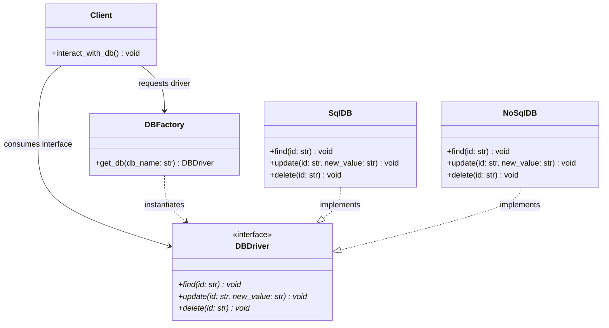
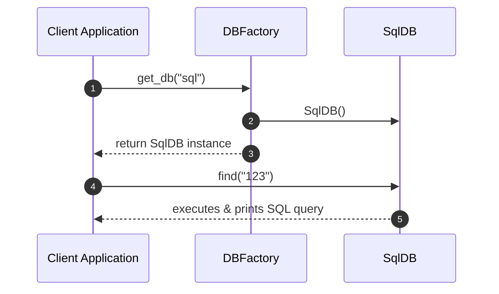

# Factory Design Pattern - Learning & Revision Guide

The **Factory Pattern** (specifically Simple Factory / Factory Method) is a creational design pattern that provides an interface for creating objects in a superclass, but allows the instantiation logic to be centralized and determined based on input parameters or subclasses. It encapsulates object creation, promoting loose coupling between the client and concrete implementations.

---

## 💡 Core Concept

Think of a **car rental service desk**:
- When you request a vehicle, you tell the desk clerk what category you need (e.g., "Economy" or "SUV").
- You do not walk into the garage, select raw steel, assemble an engine, install transmission parts, and build the car yourself.
- The desk clerk (the **Factory**) handles the selection and retrieval process, returning a vehicle that adheres to the standard `Car` interface (`drive()`, `brake()`, `refuel()`).

> [!NOTE]
> **Key Rule of Thumb:** 
> - Factory encapsulates the `new` operator or concrete class instantiation.
> - Callers program to an **interface / abstraction**, never to concrete implementations.

---

## 🛠️ The Problem & Solution

### The Problem (Direct Coupling to Concrete Classes)
Suppose an application needs to interact with databases. Without a factory, client code creates database driver instances directly:
```python
if db_type == "sql":
    driver = SqlDB()
elif db_type == "nosql":
    driver = NoSqlDB()
```
If you instantiate database drivers directly across dozens of service classes:
1. **Tight Coupling:** Every service class is directly coupled to `SqlDB` and `NoSqlDB`.
2. **Duplication:** Any complex initialization logic (connection strings, timeouts, authentication, pooling) is duplicated everywhere.
3. **Fragility:** Adding a new database driver (e.g. `MongoGraphDB`) requires finding and updating every file where drivers are instantiated.

### The Solution (Centralized DBFactory)
Introduce a [DBFactory](file:///D:/distributed-crawler/lld/creational/factory/DBfactory.py#L74) class responsible for driver instantiation:
1. Define a standard interface ([DBDriver](file:///D:/distributed-crawler/lld/creational/factory/DBfactory.py#L4)) with CRUD methods (`find`, `update`, `delete`).
2. Have [SqlDB](file:///D:/distributed-crawler/lld/creational/factory/DBfactory.py#L44) and [NoSqlDB](file:///D:/distributed-crawler/lld/creational/factory/DBfactory.py#L59) implement this interface.
3. Client code calls `factory.get_db("sql")` and interacts solely through the [DBDriver](file:///D:/distributed-crawler/lld/creational/factory/DBfactory.py#L4) interface.

---

## 📊 Design & Architecture

### UML Class Diagram



### Sequence Flow Diagram



---

## 🔍 Code Walkthrough

The implementation is located in [DBfactory.py](file:///D:/distributed-crawler/lld/creational/factory/DBfactory.py):

1. **The Interface**: [DBDriver](file:///D:/distributed-crawler/lld/creational/factory/DBfactory.py#L4)
   Abstract Base Class defining the contract:
   - [find(id)](file:///D:/distributed-crawler/lld/creational/factory/DBfactory.py#L13): Retrieve record by ID.
   - [update(id, new_value)](file:///D:/distributed-crawler/lld/creational/factory/DBfactory.py#L23): Update record.
   - [delete(id)](file:///D:/distributed-crawler/lld/creational/factory/DBfactory.py#L34): Delete record.
2. **Concrete Products**:
   - [SqlDB](file:///D:/distributed-crawler/lld/creational/factory/DBfactory.py#L44): Implements relational SQL database behavior.
   - [NoSqlDB](file:///D:/distributed-crawler/lld/creational/factory/DBfactory.py#L59): Implements NoSQL document database behavior.
3. **The Factory**: [DBFactory](file:///D:/distributed-crawler/lld/creational/factory/DBfactory.py#L74)
   Contains [get_db()](file:///D:/distributed-crawler/lld/creational/factory/DBfactory.py#L82) which normalizes the input string and instantiates the matching driver, or raises a `ValueError` for unsupported types.

---

## 💻 Example Usage Code

From [DBfactory.py](file:///D:/distributed-crawler/lld/creational/factory/DBfactory.py#L106):

```python
from DBfactory import DBFactory

if __name__ == "__main__":
    factory = DBFactory()

    # 1. Retrieve and use the SQL driver
    sql = factory.get_db("sql")
    print(f"Obtained driver: {sql}")
    sql.find("123")
    sql.update("123", "Alice")
    sql.delete("123")

    print("-" * 40)

    # 2. Retrieve and use the NoSQL driver
    nosql = factory.get_db("nosql")
    print(f"Obtained driver: {nosql}")
    nosql.find("456")
    nosql.update("456", "Bob")
    nosql.delete("456")
```

### Expected Output
```text
Obtained driver: <DBfactory.SqlDB object at 0x...>
find in sql called for id : 123
update called in sql for 123 and new value Alice
delete called in sql for 123
----------------------------------------
Obtained driver: <DBfactory.NoSqlDB object at 0x...>
find in no sql called for id : 456
update called in no sql for 456 and new value Bob
delete called in no sql for 456
```

---

## 🧠 Revision Cheat-Sheet

> [!TIP]
> Use the Factory Pattern when you don't know beforehand the exact types and dependencies of the objects your code should work with, or when you want to centralize complex initialization logic.

### 🌟 Key Design Principles Met
1. **Single Responsibility Principle (SRP):** Object creation code is isolated in a single factory class instead of scattered across client code.
2. **Open-Closed Principle (OCP):** You can extend the system with new product classes without altering the consumer business logic.
3. **Dependency Inversion Principle (DIP):** Client code depends on the abstract `DBDriver` interface rather than concrete `SqlDB` or `NoSqlDB` classes.

### ⚖️ Trade-offs
| Pros ✅ | Cons ❌ |
| :--- | :--- |
| **Decoupling:** Eliminates binding of client code to concrete implementations. | **Class Sprawl:** Introduces multiple helper classes and interfaces. |
| **Centralized Configuration:** Initialization, validation, or pooling logic lives in one place. | **Simple Factory OCP limitation:** In a simple parameterized factory, adding a new type requires modifying the `if/else` block (unless a registry map is used). |
| **Testability:** Easy to mock database drivers in unit tests by injecting mock objects. | **Indirection:** Adds a layer of indirection compared to direct instantiation. |

### 🛠️ Real-world Examples
- **Python Standard Library `logging`:** `logging.getLogger("name")` acts as a factory returning logger instances.
- **SQLAlchemy:** `create_engine("postgresql://...")` factory creating appropriate dialect engines.
- **Serialization Formatter:** `SerializerFactory.get_serializer("json" | "xml" | "yaml")`.

---

## ❓ Frequently Asked Interview Questions

1. **What is the difference between Simple Factory, Factory Method, and Abstract Factory?**
   - **Simple Factory:** A single concrete class with a method (like `get_db(type)`) with conditional logic.
   - **Factory Method:** Defines an abstract method in an abstract creator class; subclasses override it to create specific products via inheritance.
   - **Abstract Factory:** An interface for creating families of related products without specifying concrete classes.

2. **How can you avoid modifying the Simple Factory `if/else` block when adding new types (Strict OCP)?**
   - Use a **Class Registry Map** (Dictionary) or Python reflection/decorators:
     ```python
     class DBFactory:
         _registry = {}
         @classmethod
         def register(cls, key, driver_cls):
             cls._registry[key] = driver_cls
         def get_db(self, db_name):
             return self._registry[db_name]()
     ```

3. **When should you NOT use a Factory?**
   - When object creation is trivial (e.g. `point = Point(x, y)`), objects have no polymorphic behavior, or only one concrete class will ever exist.

---

## 🚀 How to Run the Example

Run the script from the workspace root:

```bash
python creational/factory/DBfactory.py
```
