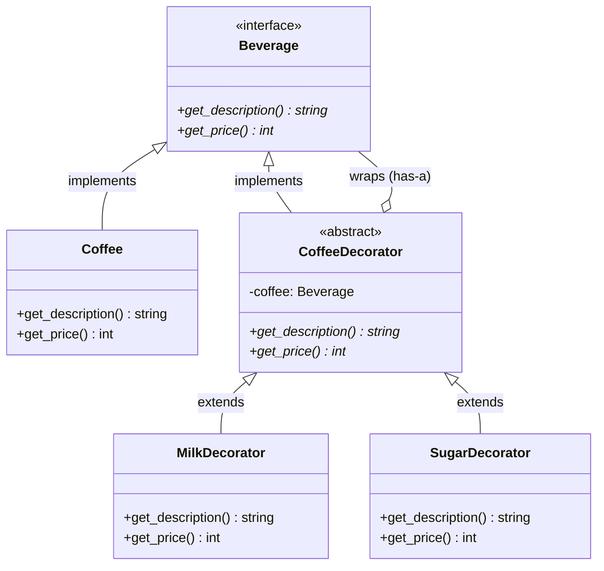
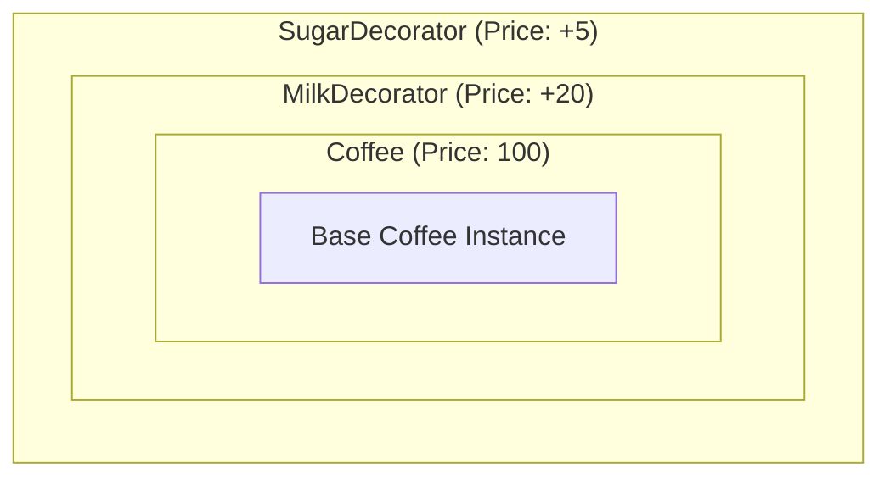

# Decorator Design Pattern - Learning & Revision Guide

The **Decorator Pattern** is a structural design pattern that allows behavior to be added to an individual object, dynamically, without affecting the behavior of other objects from the same class.

This guide helps you understand, learn, and revise the implementation found in [decorator.py](file:///D:/distributed-crawler/lld/decorator/decorator.py).

---

## 💡 Core Concept

Instead of using **inheritance** to extend behavior (which happens at compile-time and applies to all instances of a class), the Decorator pattern uses **composition** (wrapping) to extend behavior at runtime.

> [!NOTE]
> **Key Rule of Thumb:** 
> Decorators have both an **"Is-a"** and a **"Has-a"** relationship with the component they decorate.
> - **Is-a (Inheritance/Realization):** The decorator implements the same interface as the wrapped object. This allows the decorator to stand in place of the original object transparently.
> - **Has-a (Composition):** The decorator holds a reference to an instance of the component interface.

---

## 🛠️ The Problem & Solution

### The Problem (Class Explosion)
Imagine you have a base [Coffee](file:///D:/distributed-crawler/lld/decorator/decorator.py#L23) class. Customers want various combinations of condiments: Milk, Sugar, Whip, Soy, Caramel, etc.
- If you use inheritance: You would need `CoffeeWithMilk`, `CoffeeWithSugar`, `CoffeeWithMilkAndSugar`, `CoffeeWithWhipAndMilk`, and so on. This leads to a **combinatorial class explosion**.
- If you use boolean flags in the base class: Adding new condiments requires modifying the base class, violating the **Open-Closed Principle (OCP)**.

### The Solution (Wrapper Stack)
Create decorator classes that wrap the base component. Each decorator adds its own behavior (e.g., adding price, appending description) and delegates the rest of the call to the wrapped component.

---

## 📊 Design & Architecture

### UML Class Diagram



### Runtime Object Wrapping (Stacking)
When you instantiate a coffee with both milk and sugar, the objects wrap each other like onion layers:



When [get_price()](file:///D:/distributed-crawler/lld/decorator/decorator.py#L60) is called on `SugarDecorator`:
1. `SugarDecorator` calls `MilkDecorator.get_price()`.
2. `MilkDecorator` calls `Coffee.get_price()` which returns `100`.
3. `MilkDecorator` adds `20` and returns `120`.
4. `SugarDecorator` adds `5` and returns `125`.

---

## 🔍 Code Walkthrough

The codebase contains the following key elements in [decorator.py](file:///D:/distributed-crawler/lld/decorator/decorator.py):

1. **Component Interface**: [Beverage](file:///D:/distributed-crawler/lld/decorator/decorator.py#L13)
   Defines the interface for objects that can have responsibilities added to them dynamically.
2. **Concrete Component**: [Coffee](file:///D:/distributed-crawler/lld/decorator/decorator.py#L23)
   The basic object to which additional responsibilities can be attached.
3. **Base Decorator**: [CoffeeDecorator](file:///D:/distributed-crawler/lld/decorator/decorator.py#L33)
   Maintains a reference to a [Beverage](file:///D:/distributed-crawler/lld/decorator/decorator.py#L13) object and defines an interface that conforms to [Beverage](file:///D:/distributed-crawler/lld/decorator/decorator.py#L13)'s interface.
4. **Concrete Decorators**:
   - [MilkDecorator](file:///D:/distributed-crawler/lld/decorator/decorator.py#L47): Adds milk and increases the price by `20`.
   - [SugarDecorator](file:///D:/distributed-crawler/lld/decorator/decorator.py#L55): Adds sugar and increases the price by `5`.

### Example Usage Code from [main](file:///D:/distributed-crawler/lld/decorator/decorator.py#L63)

```python
# Create a base coffee
coffee = Coffee()  # Description: "coffe it is", Price: 100

# Wrap it with Milk
coffee_with_milk = MilkDecorator(coffee)  # Description: "coffe it is  , Milk ", Price: 120

# Wrap the milk coffee with Sugar
coffee_with_milk_and_sugar = SugarDecorator(coffee_with_milk)  # Description: "coffe it is  , Milk  , Sugar", Price: 125
```

---

## 🧠 Revision Cheat-Sheet

> [!TIP]
> Use this quick guide for revision right before design interviews or exams.

### 🌟 Key Design Principles Met
1. **Open-Closed Principle (OCP):** Classes are open for extension (via new decorators) but closed for modification (no need to change existing beverage or decorator code).
2. **Single Responsibility Principle (SRP):** Instead of one monolithic class containing all condiment logic, each decorator has the single responsibility of managing its own condiment (e.g. sugar calculation).

### ⚖️ Trade-offs
| Pros ✅ | Cons ❌ |
| :--- | :--- |
| **Greater Flexibility:** Responsibilities can be added/removed at runtime. | **Hard to Debug:** Stacks of wrappers can make stack traces hard to read. |
| **Avoids Class Explosion:** Combines features dynamically without sub-classing every combination. | **Code Overhead:** Leads to many small objects/classes that look similar. |
| **SRP Compliance:** Divides a complex feature set into dedicated decorator classes. | **Initialization Complexity:** Setting up deeply nested objects can be tedious (can be solved using the Builder or Factory pattern). |

### 🛠️ Real-world Examples
- **Java I/O Streams:** `BufferedReader(InputStreamReader(System.in))` - wrapping raw byte streams to read characters and then lines.
- **Python Function Decorators (`@decorator`):** Wrap functions to add logging, caching, or access control. *(Conceptually identical, syntactically native to Python)*.
- **GUI Toolkits:** Adding scrollbars, borders, or shadows dynamically around components.

---

## ❓ Frequently Asked Interview Questions

1. **What is the difference between Decorator Pattern and Inheritance?**
   - Inheritance extends class behavior statically at compile-time. Decorator wraps individual objects to extend behavior dynamically at runtime.

2. **Can a Decorator change the interface of the object it wraps?**
   - No. By definition, a decorator must conform to the interface of the object it decorates so it remains transparent to the client. If it changes/adds new methods to the public API, it is acting more like an **Adapter**.

3. **How does the Decorator Pattern compare to the Proxy Pattern?**
   - **Decorator** focuses on dynamically adding/extending behaviors/features.
   - **Proxy** focuses on controlling access to the underlying object (e.g., lazy loading, security, logging, caching) and usually manages the lifecycle of the real subject itself.
