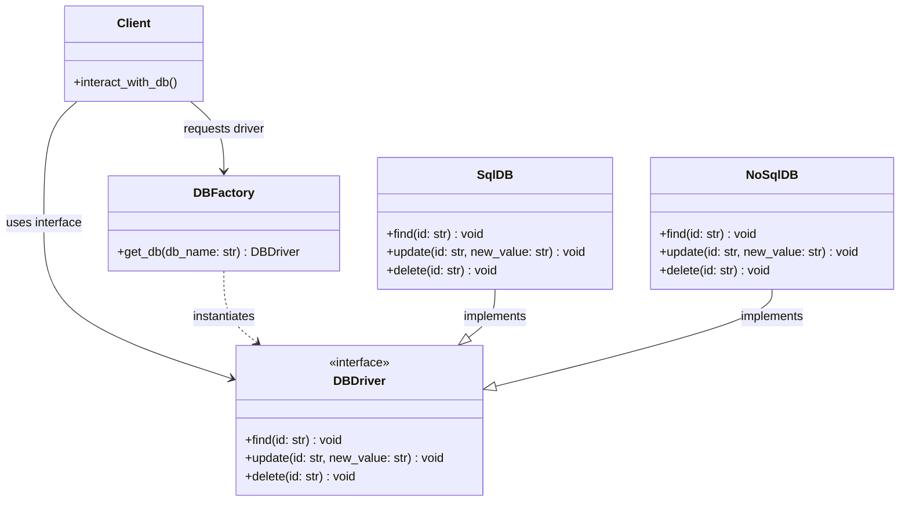

# Factory Design Pattern

The **Factory Pattern** is a creational design pattern that provides an interface for creating objects in a superclass, but allows subclasses to alter the type of objects that will be created. It encapsulates instantiation logic, promoting loose coupling between the client and the concrete classes.

---

## Table of Contents
- [How It Works](#how-it-works)
- [Why Use Factory?](#why-use-factory)
- [Implementation Details in Python](#implementation-details-in-python)
  - [The Interface (`DBDriver`)](#the-interface-dbdriver)
  - [Concrete Implementations (`SqlDB` / `NoSqlDB`)](#concrete-implementations-sqldb--nosqldb)
  - [The Factory (`DBFactory`)](#the-factory-dbfactory)
- [Usage Examples](#usage-examples)

---

## How It Works

Instead of the client instantiating concrete database drivers directly (e.g., `db = SqlDB()`), the client delegates the creation to `DBFactory`. The factory returns an object that implements the `DBDriver` interface, ensuring that the client remains decoupled from specific database implementations.



---

## Why Use Factory?

### Advantages
- **Loose Coupling**: The client code only depends on the interface (`DBDriver`) rather than concrete classes (`SqlDB`, `NoSqlDB`).
- **Single Responsibility Principle (SRP)**: You can extract the product creation code into one place in the program, making the code easier to support and maintain.
- **Open/Closed Principle (OCP)**: You can introduce new database types into the program without breaking existing client code (though in a Simple Factory, the factory class itself may need modifications).
- **Centralized Creation Logic**: If instantiating a driver requires complex configuration (e.g., loading connection strings, configuring connection pools), that logic is isolated inside the factory rather than duplicated across client code.

### Disadvantages
- **Increased Code Complexity**: The code can become more complicated since you need to introduce new interfaces and classes to implement the program.

---

## Implementation Details in Python

### The Interface (`DBDriver`)
We use Python's `abc` (Abstract Base Classes) module to enforce the `DBDriver` interface contract.
```python
from abc import ABC, abstractmethod

class DBDriver(ABC):
    @abstractmethod
    def find(self, id: str):
        pass

    @abstractmethod
    def update(self, id: str, new_value: str):
        pass

    @abstractmethod
    def delete(self, id: str):
        pass
```

### Concrete Implementations (`SqlDB` / `NoSqlDB`)
These classes implement the abstract methods defined by `DBDriver`.
```python
class SqlDB(DBDriver):
    def find(self, id: str):
        print(f"find in sql called for id : {id}")
    # ... other methods
```

### The Factory (`DBFactory`)
The factory exposes a method that takes a configuration parameter (like a string identifier) and returns the corresponding concrete instance.
```python
class DBFactory:
    def get_db(self, db_name: str) -> DBDriver:
        normalized_name = db_name.strip().lower()
        if normalized_name == "sql":
            return SqlDB()
        elif normalized_name == "nosql":
            return NoSqlDB()
        else:
            raise ValueError(f"Unsupported database type: '{db_name}'")
```

---

## Usage Examples

Here is the complete implementation and demonstration from [DBfactory.py](file:///D:/distributed-crawler/lld/factory/DBfactory.py):

```python
from abc import ABC, abstractmethod

class DBDriver(ABC):
    # Interface definitions...
    pass

# ... Concrete classes SqlDB and NoSqlDB ...

class DBFactory:
    def get_db(self, db_name: str) -> DBDriver:
        # Instantiation logic...
        pass

if __name__ == "__main__":
    factory = DBFactory()
    
    # 1. Retrieve and use the SQL driver
    sql = factory.get_db("sql")
    sql.find("123")
    
    # 2. Retrieve and use the NoSQL driver
    nosql = factory.get_db("nosql")
    nosql.find("456")
```
