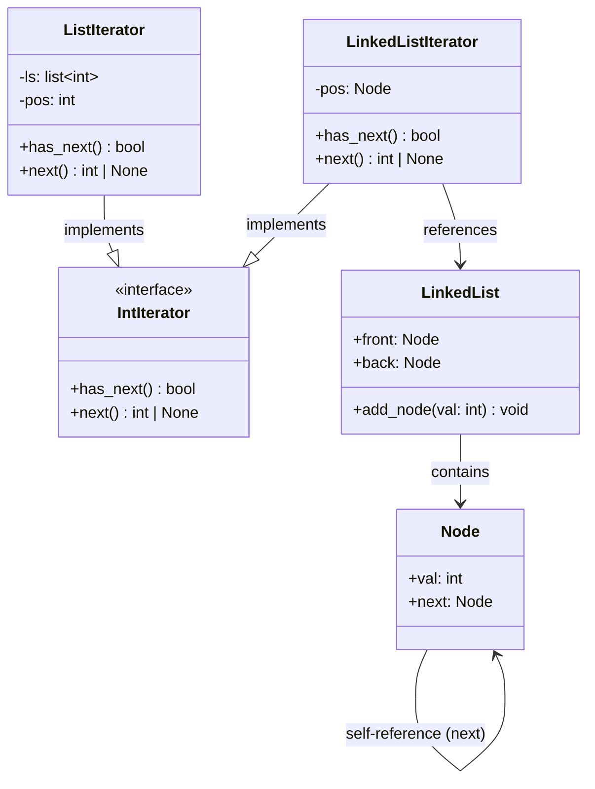

# Iterator Design Pattern

The **Iterator Pattern** is a behavioral design pattern that allows sequential traversal of a complex collection's elements without exposing its underlying representation (e.g., lists, stacks, trees, or graphs).

---

## Table of Contents
- [How It Works](#how-it-works)
- [Why Use Iterator?](#why-use-iterator)
- [Python-Specific Implementation Details](#python-specific-implementation-details)
  - [The Custom Iterator Interface (`IntIterator`)](#the-custom-iterator-interface-intiterator)
  - [Collection and Node Setup (`Node`, `LinkedList`)](#collection-and-node-setup-node-linkedlist)
  - [Concrete Iterators (`ListIterator`, `LinkedListIterator`)](#concrete-iterators-listiterator-linkedlistiterator)
  - [Python's Native Iterator Protocol (`__iter__` / `__next__`)](#pythons-native-iterator-protocol-__iter____next__)
- [Usage Examples](#usage-examples)

---

## How It Works

The core idea of the Iterator pattern is to extract the traversal state (such as the current position) out of the collection and place it inside a separate **Iterator** object. 

Different collections can implement their own specific iterators conforming to a common interface. The client only interacts with the iterator interface, making the traversal code independent of the underlying storage format.



---

## Why Use Iterator?

### Advantages
- **Clean Client Code**: The client does not need to know whether it is traversing a contiguous list or a complex graph of linked nodes. The traversal code looks identical.
- **Single Responsibility Principle (SRP)**: You clean up the client and collection classes by moving the complex traversal algorithms into separate iterator classes.
- **Concurrent/Independent Traversals**: Multiple iterators can traverse the same collection simultaneously because each iterator object maintains its own iteration state (like current index or pointer).

### Disadvantages
- **Overkill for Simple Collections**: If your application only uses basic arrays or lists, introducing custom iterator interfaces and classes can add unnecessary complexity.

---

## Python-Specific Implementation Details

### The Custom Iterator Interface (`IntIterator`)
Defined in [iterator.py](file:///D:/distributed-crawler/lld/iterator/iterator.py), this abstract base class defines the Java/C++ style iterator contract containing `has_next()` and `next()`.
```python
from abc import ABC, abstractmethod

class IntIterator(ABC):
    @abstractmethod
    def has_next(self) -> bool:
        pass

    @abstractmethod
    def next(self) -> int | None:
        pass
```

### Collection and Node Setup (`Node`, `LinkedList`)
Defined in [linkedlist.py](file:///D:/distributed-crawler/lld/iterator/linkedlist.py), this class constructs a custom singly-linked list structure.
```python
class Node:
    def __init__(self, val: int, next_node: Node | None = None) -> None:
        self.val = val
        self.next = next_node
```

### Concrete Iterators (`ListIterator`, `LinkedListIterator`)
* **`ListIterator`** (defined in [list.py](file:///D:/distributed-crawler/lld/iterator/list.py)) traverses standard Python list elements sequentially using an index offset.
* **`LinkedListIterator`** (defined in [linkedlist.py](file:///D:/distributed-crawler/lld/iterator/linkedlist.py)) traverses linked nodes by updating a reference to the next node.

### Python's Native Iterator Protocol (`__iter__` / `__next__`)
In idiomatic Python, you typically don't build custom `has_next()` and `next()` methods. Instead, you implement the native Python iterator protocol:
1. `__iter__()`: Returns the iterator object itself.
2. `__next__()`: Returns the next item or raises the standard `StopIteration` exception when complete.

To bridge our custom `IntIterator` with Python's native `for` loop, you could add:
```python
class NativeIteratorBridge:
    def __init__(self, custom_iterator: IntIterator):
        self.iterator = custom_iterator

    def __iter__(self):
        return self

    def __next__(self):
        if self.iterator.has_next():
            return self.iterator.next()
        raise StopIteration
```

---

## Usage Examples

Run [main.py](file:///D:/distributed-crawler/lld/iterator/main.py) to see the traversals in action:

```bash
python main.py
```

### Excerpt from `main.py`
```python
from linkedlist import LinkedList, LinkedListIterator
from list import ListIterator

# Traversing standard list
ls = [1, 2, 3, 4, 5]
ls_iter = ListIterator(ls)
while ls_iter.has_next():
    print(ls_iter.next())

# Traversing custom LinkedList
ll = LinkedList()
ll.add_node(10)
ll.add_node(20)

ll_iter = LinkedListIterator(ll)
while ll_iter.has_next():
    print(ll_iter.next())
```
