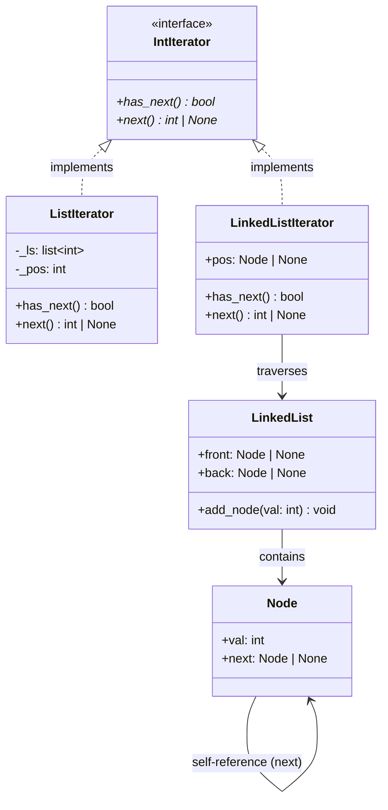
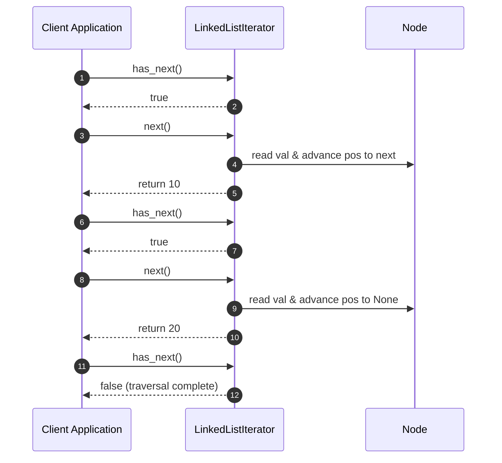

# Iterator Design Pattern - Learning & Revision Guide

The **Iterator Pattern** is a behavioral design pattern that allows sequential traversal of elements in a complex collection without exposing its underlying representation (e.g., contiguous lists, singly/doubly linked nodes, binary trees, or graphs).

---

## 💡 Core Concept

Think of a **TV remote control with "Next Channel" and "Previous Channel" buttons**:
- The viewer clicks "Next Channel" to cycle through television stations.
- The viewer doesn't need to know whether the TV receives signals via analog antennas, coaxial cable networks, satellite dishes, or internet fiber streaming.
- The remote control (the **Iterator**) maintains the current station position and provides a uniform navigation interface regardless of how channels are stored internally.

> [!NOTE]
> **Key Rule of Thumb:** 
> - Separate the **data structure** (collection) from the **traversal algorithm** (iterator).
> - Multiple iterators can traverse the same collection independently and concurrently without interfering with each other.

---

## 🛠️ The Problem & Solution

### The Problem (Exposing Internal Collection Storage)
Suppose your application stores items in diverse data structures: some in standard arrays ([list.py](file:///D:/distributed-crawler/lld/iterator/list.py)), some in linked lists ([linkedlist.py](file:///D:/distributed-crawler/lld/iterator/linkedlist.py)), and others in binary search trees.
- Without an iterator, client code must write completely different looping logic for each structure:
  - For lists: indexed access `items[i]` with integer increment.
  - For linked lists: node pointer following `current = current.next`.
  - For trees: stack-based in-order/pre-order traversal.
- This tightly couples client code to internal collection representations and duplicates traversal algorithms across the codebase.

### The Solution (Uniform Traversal Contract)
1. Define a common iterator interface ([IntIterator](file:///D:/distributed-crawler/lld/iterator/iterator.py#L5)) declaring standard traversal methods: `has_next() -> bool` and `next() -> int | None`.
2. Implement concrete iterators for each collection type:
   - [ListIterator](file:///D:/distributed-crawler/lld/iterator/list.py#L5) for index-based array iteration.
   - [LinkedListIterator](file:///D:/distributed-crawler/lld/iterator/linkedlist.py#L49) for pointer-based node traversal.
3. The client writes a single traversal loop using `has_next()` and `next()`, completely oblivious to whether the elements are in an array or a linked list.

---

## 📊 Design & Architecture

### UML Class Diagram


```mermaid
classDiagram
    class IntIterator {
        <<interface>>
        +has_next()* bool
        +next()* int | None
    }

    class ListIterator {
        -_ls: list~int~
        -_pos: int
        +has_next() bool
        +next() int | None
    }

    class LinkedListIterator {
        +pos: Node | None
        +has_next() bool
        +next() int | None
    }

    class LinkedList {
        +front: Node | None
        +back: Node | None
        +add_node(val: int) void
    }

    class Node {
        +val: int
        +next: Node | None
    }

    IntIterator <|.. ListIterator : implements
    IntIterator <|.. LinkedListIterator : implements
    LinkedListIterator --> LinkedList : traverses
    LinkedList --> Node : contains
    Node --> Node : self-reference (next)
```

### Traversal Flow Diagram


```mermaid
sequenceDiagram
    autonumber
    participant Client as Client Application
    participant Iter as LinkedListIterator
    participant Node as Node

    Client->>Iter: has_next()
    Iter-->>Client: true
    Client->>Iter: next()
    Iter->>Node: read val & advance pos to next
    Iter-->>Client: return 10

    Client->>Iter: has_next()
    Iter-->>Client: true
    Client->>Iter: next()
    Iter->>Node: read val & advance pos to None
    Iter-->>Client: return 20

    Client->>Iter: has_next()
    Iter-->>Client: false (traversal complete)
```

---

## 🔍 Code Walkthrough

The codebase is organized into clean, focused components:

1. **Iterator Interface**: [IntIterator](file:///D:/distributed-crawler/lld/iterator/iterator.py#L5)
   - [has_next()](file:///D:/distributed-crawler/lld/iterator/iterator.py#L14): Returns `True` if more elements remain.
   - [next()](file:///D:/distributed-crawler/lld/iterator/iterator.py#L24): Returns the next element or `None`.
2. **Collection & Node Structures**:
   - [Node](file:///D:/distributed-crawler/lld/iterator/linkedlist.py#L5): Single node holding an integer `val` and optional `next` pointer.
   - [LinkedList](file:///D:/distributed-crawler/lld/iterator/linkedlist.py#L22): Singly-linked list managing `front` and `back` pointers, supporting [add_node()](file:///D:/distributed-crawler/lld/iterator/linkedlist.py#L32).
3. **Concrete Iterators**:
   - [ListIterator](file:///D:/distributed-crawler/lld/iterator/list.py#L5): Maintains internal index `_pos`. In `next()`, returns `_ls[_pos]` and increments `_pos`.
   - [LinkedListIterator](file:///D:/distributed-crawler/lld/iterator/linkedlist.py#L49): Maintains `pos` pointer initialized to `ll.front`. In `next()`, reads `pos.val` and advances `pos = pos.next`.
4. **Client Runner**: [main.py](file:///D:/distributed-crawler/lld/iterator/main.py#L5)
   Traverses both list types using identical while-loop patterns.

---

## 💻 Example Usage Code

From [main.py](file:///D:/distributed-crawler/lld/iterator/main.py):

```python
from linkedlist import LinkedList, LinkedListIterator
from list import ListIterator

def run_iterator_demo() -> None:
    # 1. Standard Python list iteration
    print("--- Demonstrating List Iterator ---")
    ls = [1, 2, 3, 4, 5]
    ls_iter = ListIterator(ls)
    while ls_iter.has_next():
        print(f"List element: {ls_iter.next()}")

    # 2. Custom LinkedList iteration
    print("\n--- Demonstrating LinkedList Iterator ---")
    ll = LinkedList()
    ll.add_node(10)
    ll.add_node(20)
    ll.add_node(30)

    ll_iter = LinkedListIterator(ll)
    while ll_iter.has_next():
        print(f"LinkedList element: {ll_iter.next()}")

if __name__ == "__main__":
    run_iterator_demo()
```

### Expected Output
```text
--- Demonstrating List Iterator ---
List element: 1
List element: 2
List element: 3
List element: 4
List element: 5

--- Demonstrating LinkedList Iterator ---
LinkedList element: 10
LinkedList element: 20
LinkedList element: 30
```

---

## 🧠 Revision Cheat-Sheet

> [!TIP]
> Use the Iterator pattern to provide a uniform traversal interface across different internal data structures, or to allow multiple simultaneous traversals.

### 🌟 Key Design Principles Met
1. **Single Responsibility Principle (SRP):** You extract traversal algorithms out of the collection classes into separate iterator classes.
2. **Open-Closed Principle (OCP):** You can implement new types of collections and new types of iterators (e.g., ReverseIterator, FilterIterator) without breaking existing code.
3. **Information Hiding:** Internal pointers, array indices, and node structures remain private.

### ⚖️ Trade-offs
| Pros ✅ | Cons ❌ |
| :--- | :--- |
| **Uniform Client Code:** Identical traversal loop across completely different data structures. | **Overkill for Simple Lists:** Adds unnecessary classes if you only ever use built-in arrays. |
| **Independent Traversals:** Multiple iterators can advance at different speeds through the same collection. | **Concurrent Modification Hazard:** Modifying a collection while an iterator is actively traversing can cause unexpected errors without fail-fast guards. |
| **Lazy Evaluation:** Iterators can compute elements on the fly (generators / infinite streams). | **Memory Overhead:** Storing separate iterator objects incurs minor heap allocation. |

### 🛠️ Real-world Examples
- **Python's Native Iterator Protocol:** `__iter__()` returning an object with `__next__()` that raises `StopIteration`.
- **Database Cursors:** Fetching row-by-row from query results without loading the entire table into RAM.
- **Java / C++ Standard Template Library:** Java's `java.util.Iterator` (`hasNext()`, `next()`) and C++ STL iterators.

---

## ❓ Frequently Asked Interview Questions

1. **How does this custom Iterator relate to Python's native `__iter__` and `__next__`?**
   - The custom `has_next()` / `next()` follows the classic GoF / Java style. In idiomatic Python, you implement `__iter__()` and `__next__()`, allowing standard Python `for item in collection:` syntax.

2. **What is a "Fail-Fast" vs "Fail-Safe" iterator?**
   - **Fail-Fast:** Detects if the underlying collection is modified during traversal (e.g. via a modification counter `mod_count`) and immediately raises an exception (`ConcurrentModificationException`).
   - **Fail-Safe:** Works on a clone or snapshot of the collection, allowing modifications without crashing.

3. **Can an iterator traverse infinite streams?**
   - Yes! Because the iterator evaluates elements lazily one-by-one, it can produce an infinite sequence (e.g., Fibonacci numbers, event streams, sensor telemetry) without exhausting system memory.

---

## 🚀 How to Run the Example

Run the main file from the workspace root:

```bash
python iterator/main.py
```
