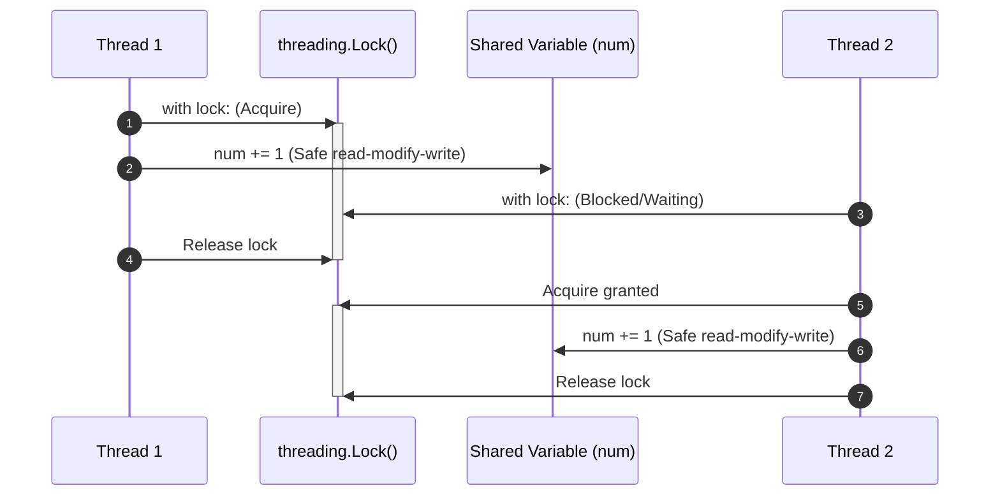
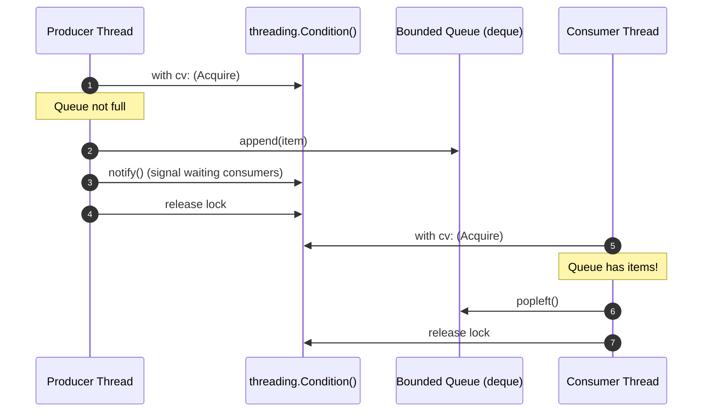

# Multi-Threading & Concurrency Patterns - Learning & Revision Guide

This directory covers foundational multi-threading and concurrency patterns in Python using the standard `threading` module. It demonstrates thread lifecycles, race conditions, mutual exclusion locks, condition synchronization, and the classic Producer-Consumer pattern.

---

## 💡 Core Concept

Think of multiple **chefs working in a single kitchen sharing one stove**:
- If two chefs dump different ingredients into the exact same pot at the same time without coordinating, the dish is ruined (a **Race Condition**).
- A **Lock (Mutex)** is like an "Occupied" sign on the stove door: only one chef can use the stove at a time.
- A **Condition Variable** is like a bell: when Chef 1 finishes boiling pasta, they ring the bell (`notify()`) so Chef 2 (who was waiting/resting via `wait()`) wakes up to add the sauce.

> [!NOTE]
> **Python's GIL (Global Interpreter Lock):** 
> - In CPython, the GIL allows only one native thread to execute Python bytecode at any given moment.
> - Multi-threading in Python is optimal for **I/O-bound tasks** (network requests, disk I/O, database queries, web scraping).
> - For **CPU-bound tasks** (data science, image processing, heavy math), use the `multiprocessing` module instead.

---

## 🛠️ Concurrency Primitives Overview

| Primitive | Mechanism | Primary Use Case | Example File |
| :--- | :--- | :--- | :--- |
| **Thread** | Lightweight execution unit sharing process memory | Concurrently running background or I/O tasks | [create_threads.py](file:///D:/distributed-crawler/lld/multi-threading/create_threads.py) |
| **Lock (Mutex)** | Mutual exclusion lock (`acquire()` / `release()`) | Guarding shared mutable state against race conditions | [locks.py](file:///D:/distributed-crawler/lld/multi-threading/locks.py), [print_even_odd_with_locks.py](file:///D:/distributed-crawler/lld/multi-threading/print_even_odd_with_locks.py) |
| **Condition** | Associated with a lock; provides `wait()`, `notify()`, `notify_all()` | Thread coordination based on state changes without busy spinning | [conditionals.py](file:///D:/distributed-crawler/lld/multi-threading/conditionals.py), [prod_cons.py](file:///D:/distributed-crawler/lld/multi-threading/prod_cons.py) |

---

## 📊 Design & Concurrency Flows

### 1. Lock Protection Sequence (Preventing Race Conditions)



### 2. Producer-Consumer Sequence with Condition Variable



---

## 🔍 Detailed File Walkthrough

### 1. [create_threads.py](file:///D:/distributed-crawler/lld/multi-threading/create_threads.py)
Demonstrates thread lifecycle fundamentals:
- Creating threads: `t = threading.Thread(target=func)`.
- Passing arguments using tuple syntax: `args=(i,)`.
- `t.start()` to begin thread execution concurrently.
- `t.join()` to block the caller until the thread terminates.

### 2. [locks.py](file:///D:/distributed-crawler/lld/multi-threading/locks.py)
Contrasts unprotected vs protected concurrent state mutations:
- **`race_condition_demo()`**: Two threads increment a shared counter 1,000,000 times without synchronization. Due to non-atomic read-modify-write instructions, the final count falls far short of 2,000,000.
- **`demo_with_lock()`**: Wraps the increment in `with lock:` ensuring mutual exclusion and a guaranteed count of 2,000,000.

### 3. [print_even_odd_with_locks.py](file:///D:/distributed-crawler/lld/multi-threading/print_even_odd_with_locks.py)
Coordinates two threads alternating even and odd numbers:
- A shared `threading.Lock` protects access to the counter.
- Boundary check `if num > total_num: break` inside the lock prevents out-of-bounds execution.

### 4. [conditionals.py](file:///D:/distributed-crawler/lld/multi-threading/conditionals.py)
Demonstrates efficient synchronization avoiding busy-waiting:
- Threads release the lock and sleep via `cv.wait()` when it is not their turn.
- The active thread updates the value and signals the sleeping thread via `cv.notify()`.

### 5. [prod_cons.py](file:///D:/distributed-crawler/lld/multi-threading/prod_cons.py)
Implements the classic **Producer-Consumer pattern**:
- **Bounded Buffer:** Uses `collections.deque` for $O(1)$ fast left pops.
- **Flow Control:** Producer waits if `len(q) >= max_len`; Consumer waits if `len(q) == 0`.
- **Graceful Shutdown (Poison Pill):** Appends sentinel value `-1` to cleanly terminate the consumer.

---

## 💻 Example Usage Code

From [prod_cons.py](file:///D:/distributed-crawler/lld/multi-threading/prod_cons.py):

```python
from threading import Condition, Thread
from collections import deque

q = deque()
max_len = 5
max_num = 10
cv = Condition()

def produce_item():
    for num in range(max_num):
        with cv:
            while len(q) >= max_len:
                cv.wait()
            q.append(num)
            print(f"producer produced value {num}")
            cv.notify()

    # Send poison pill sentinel
    with cv:
        while len(q) >= max_len:
            cv.wait()
        q.append(-1)
        print("producer ended")
        cv.notify()

def consume_item():
    while True:
        with cv:
            while len(q) == 0:
                cv.wait()
            val = q.popleft()
            if val == -1:
                print("consumer ended")
                break
            print(f"consumer consumed value {val}")
            cv.notify()

if __name__ == "__main__":
    t1 = Thread(target=produce_item)
    t2 = Thread(target=consume_item)
    t1.start()
    t2.start()
    t1.join()
    t2.join()
```

---

## 🧠 Revision Cheat-Sheet

> [!TIP]
> Always check condition states inside a `while` loop (`while not condition: cv.wait()`), NEVER an `if` statement, to protect against spurious wakeups!

### 🌟 Key Synchronization Concepts
- **Race Condition:** Bug where output depends on non-deterministic thread execution timing.
- **Deadlock:** Two or more threads are permanently blocked waiting for locks held by each other.
- **Starvation:** A thread is perpetually denied CPU time or lock acquisition because other threads have priority.
- **Spurious Wakeup:** A thread wakes up from `wait()` without being explicitly notified; looping `while` re-checks the predicate safely.

### ⚖️ Trade-offs
| Pros ✅ | Cons ❌ |
| :--- | :--- |
| **Concurrency & Responsiveness:** Allows background processing while maintaining responsive I/O. | **GIL Limitations in Python:** CPU-bound tasks cannot achieve true multi-core parallelism via threads. |
| **Low Memory Overhead:** Threads share the same address space and memory heap. | **Complex Debugging:** Non-deterministic bugs, race conditions, and deadlocks are difficult to reproduce. |
| **Shared State Communication:** Threads can communicate directly via shared memory structures. | **Locking Overhead:** Excessive lock contention degrades throughput and causes CPU cache thrashing. |

---

## ❓ Frequently Asked Interview Questions

1. **Why do we use `while` instead of `if` when calling `cv.wait()`?**
   - Because of **spurious wakeups** and race conditions. Another thread could wake up and consume the resource before this thread gets scheduled. Re-checking in a `while` loop guarantees the condition is actually true before proceeding.

2. **What is the difference between `Lock` and `RLock`?**
   - **`Lock`:** A non-reentrant lock. If a thread attempts to acquire it twice without releasing, it deadlocks itself.
   - **`RLock` (Reentrant Lock):** Can be acquired multiple times by the *same* thread. The owning thread must release it the same number of times it acquired it.

3. **What is a Deadlock and what are the 4 Coffman conditions?**
   - Deadlock occurs when threads are frozen waiting for resources held by each other. The 4 required conditions are:
     1. Mutual Exclusion
     2. Hold and Wait
     3. No Preemption
     4. Circular Wait (break this by acquiring locks in a consistent global order!)

---

## 🚀 How to Run the Examples

Run any script from the workspace root:

```bash
# 1. Thread creation basics
python multi-threading/create_threads.py

# 2. Race condition vs Lock demonstration
python multi-threading/locks.py

# 3. Even/Odd synchronization with Locks
python multi-threading/print_even_odd_with_locks.py

# 4. Condition Variables synchronization
python multi-threading/conditionals.py

# 5. Producer-Consumer Pattern
python multi-threading/prod_cons.py
```
