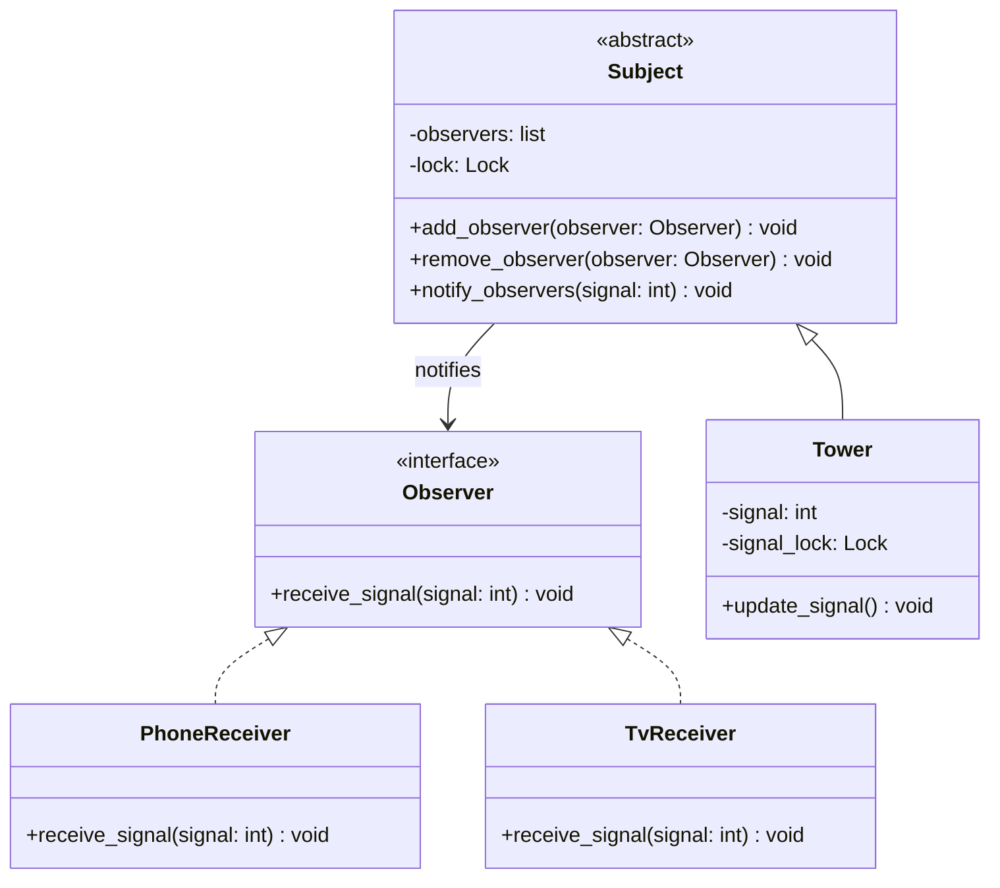

# Observer Pattern

The **Observer Pattern** is a behavioral design pattern that defines a one-to-many dependency between objects. When the state of one object (the **Subject**) changes, all its dependents (**Observers**) are notified and updated automatically.

It is also known as the **Publish-Subscribe (Pub-Sub)** pattern.

---

## Why Use the Observer Pattern?

- **Loose Coupling**: The Subject does not need to know the concrete classes of its Observers, only that they implement a specific observer interface.
- **Open-Closed Principle**: You can introduce new observer classes at any time without modifying the Subject code.
- **Dynamic Relationships**: Observers can be registered (`add_observer`) or deregistered (`remove_observer`) dynamically at runtime.

---

## Our Example Implementation

In this example, we model a radio/signal **Tower** that broadcasts numeric signal updates to multiple devices: a **Phone** and a **TV**.

### Class Diagram / Architecture



### Components

1. **[Observer](file:///D:/distributed-crawler/lld/observer/observer.py)**: The interface defining the `receive_signal` contract.
2. **[Subject](file:///D:/distributed-crawler/lld/observer/subject.py)**: The abstract base class that manages the list of observers and handles notifications. Access to the observers list is thread-safe using a `threading.Lock`.
3. **[Tower](file:///D:/distributed-crawler/lld/observer/tower.py)**: The concrete implementation of `Subject`. It maintains the state of the `signal`. When `update_signal` is called, it increments the signal value and **automatically notifies** all registered observers.
4. **[PhoneReceiver](file:///D:/distributed-crawler/lld/observer/phone_receiver.py) & [TvReceiver](file:///D:/distributed-crawler/lld/observer/tv_receiver.py)**: Concrete observers that print a message when they receive a signal broadcast.

---

## Thread Safety Considerations

In production systems, subjects and observers are often updated by different background threads. This codebase implements thread-safety measures:
- **Locking lists**: All operations modifying or reading the list of observers in `Subject` are synchronized using a lock.
- **Avoiding Deadlocks**: During notification (`notify_observers`), a shallow copy of the observers list is made under a lock, and then the lock is released before invoking the observer callbacks. This prevents deadlocks if an observer tries to add or remove itself inside its callback.
- **Atomic updates**: The `Tower` uses a signal-specific lock to ensure concurrent updates to its signal are atomic.

---

## How to Run the Example

Run the main script from the root of the project:

```bash
python observer/main.py
```
