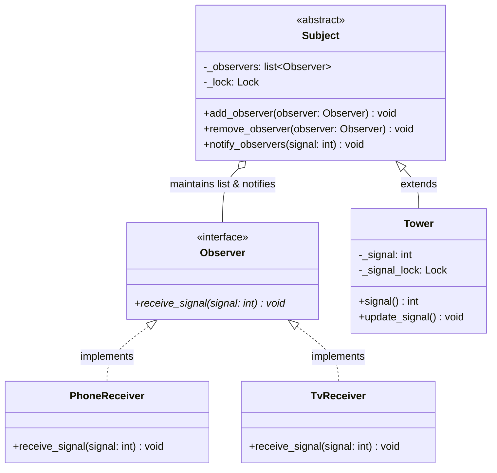
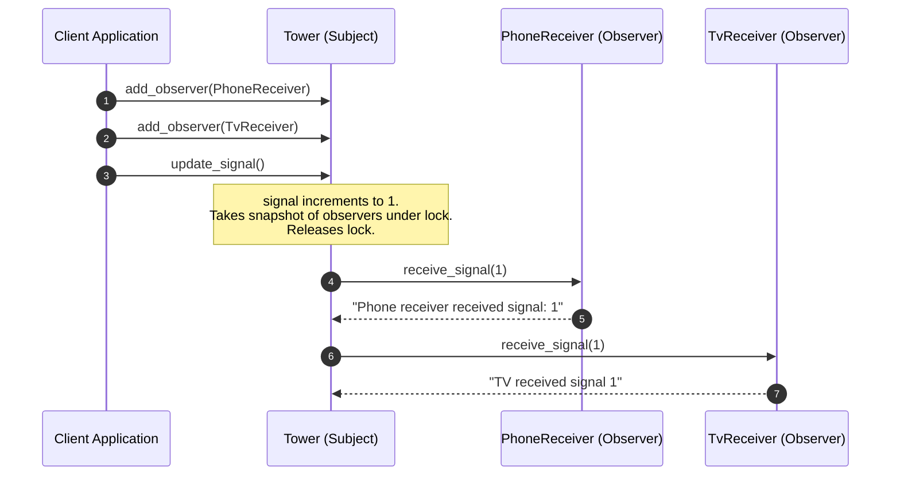

# Observer Design Pattern - Learning & Revision Guide

The **Observer Pattern** (also known as Publish-Subscribe / Pub-Sub pattern) is a behavioral design pattern that defines a one-to-many dependency between objects. When one object (the **Subject / Publisher**) changes its state, all its registered dependents (the **Observers / Subscribers**) are automatically notified and updated.

---

## 💡 Core Concept

Think of a **YouTube channel or newsletter subscription**:
- When you subscribe to a YouTube channel (the **Subject**), you don't call the creator every hour asking "Did you upload a video yet?" (polling).
- Instead, you subscribe once (`add_observer`).
- Whenever the creator uploads a new video, YouTube automatically broadcasts a push notification to all subscribers (`notify_observers`).
- You can unsubscribe at any time (`remove_observer`) to stop receiving notifications.

> [!NOTE]
> **Key Rule of Thumb:** 
> - Decouple the state-owner (Subject) from the listeners (Observers).
> - Observers should be able to register and deregister dynamically at runtime.
> - Always avoid holding locks while executing third-party observer callbacks to eliminate deadlock hazards.

---

## 🛠️ The Problem & Solution

### The Problem (Polling vs Tight Coupling)
Imagine a radio/cellular broadcast tower ([Tower](file:///D:/distributed-crawler/lld/observer/tower.py#L4)) transmitting numeric signals. Multiple devices—such as phones ([PhoneReceiver](file:///D:/distributed-crawler/lld/observer/phone_receiver.py#L3)) and televisions ([TvReceiver](file:///D:/distributed-crawler/lld/observer/tv_receiver.py#L3))—need to react immediately to new signals.
- **Polling:** If each receiver repeatedly queries the tower in a tight loop, CPU and network bandwidth are wasted, and updates are delayed by the polling interval.
- **Direct Method Invocations:** If the tower directly holds explicit references to `phone` and `tv` instances (`self.phone.ring()`, `self.tv.display()`), the tower becomes tightly coupled to specific device classes. Adding a smart watch or laptop receiver would require modifying the tower class every time.

### The Solution (Thread-Safe Event Broadcast)
1. Define an [Observer](file:///D:/distributed-crawler/lld/observer/observer.py#L3) interface with `receive_signal(signal: int)`.
2. Create a generic [Subject](file:///D:/distributed-crawler/lld/observer/subject.py#L5) base class that maintains a list of `Observer` instances with thread-safe `add_observer`, `remove_observer`, and `notify_observers`.
3. [Tower](file:///D:/distributed-crawler/lld/observer/tower.py#L4) inherits from `Subject`. When its signal updates, it calls `self.notify_observers(signal)`.
4. Any device implementing `Observer` can subscribe dynamically without the tower knowing its concrete identity.

---

## 📊 Design & Architecture

### UML Class Diagram


```mermaid
classDiagram
    class Observer {
        <<interface>>
        +receive_signal(signal: int)* void
    }

    class Subject {
        <<abstract>>
        -_observers: list~Observer~
        -_lock: Lock
        +add_observer(observer: Observer) void
        +remove_observer(observer: Observer) void
        +notify_observers(signal: int) void
    }

    class Tower {
        -_signal: int
        -_signal_lock: Lock
        +signal() int
        +update_signal() void
    }

    class PhoneReceiver {
        +receive_signal(signal: int) void
    }

    class TvReceiver {
        +receive_signal(signal: int) void
    }

    Subject <|-- Tower : extends
    Observer <|.. PhoneReceiver : implements
    Observer <|.. TvReceiver : implements
    Subject o-- Observer : maintains list & notifies
```

### Sequence Flow Diagram


```mermaid
sequenceDiagram
    autonumber
    participant Client as Client Application
    participant Tower as Tower (Subject)
    participant Phone as PhoneReceiver (Observer)
    participant TV as TvReceiver (Observer)

    Client->>Tower: add_observer(PhoneReceiver)
    Client->>Tower: add_observer(TvReceiver)
    Client->>Tower: update_signal()
    Note over Tower: signal increments to 1.<br/>Takes snapshot of observers under lock.<br/>Releases lock.
    Tower->>Phone: receive_signal(1)
    Phone-->>Tower: "Phone receiver received signal: 1"
    Tower->>TV: receive_signal(1)
    TV-->>Tower: "TV received signal 1"
```

---

## 🔍 Code Walkthrough

The implementation is modularized across dedicated files:

1. **Observer Interface**: [Observer](file:///D:/distributed-crawler/lld/observer/observer.py#L3)
   Defines the contract method `receive_signal(self, signal: int)`.
2. **Subject Base Class**: [Subject](file:///D:/distributed-crawler/lld/observer/subject.py#L5)
   - [add_observer()](file:///D:/distributed-crawler/lld/observer/subject.py#L14): Registers an observer thread-safely under `_lock`.
   - [remove_observer()](file:///D:/distributed-crawler/lld/observer/subject.py#L20): Deregisters an observer under `_lock`.
   - [notify_observers()](file:///D:/distributed-crawler/lld/observer/subject.py#L26): **Crucial thread-safety pattern**: It makes a shallow copy `observers_copy = list(self._observers)` under lock, releases the lock, and then executes callbacks. This prevents deadlocks if an observer's callback attempts to register or unregister an observer!
3. **Concrete Subject**: [Tower](file:///D:/distributed-crawler/lld/observer/tower.py#L4)
   Manages `_signal` protected by `_signal_lock`. Calling [update_signal()](file:///D:/distributed-crawler/lld/observer/tower.py#L20) increments the signal and broadcasts to all subscribers.
4. **Concrete Observers**:
   - [PhoneReceiver](file:///D:/distributed-crawler/lld/observer/phone_receiver.py#L3): Displays phone signal update.
   - [TvReceiver](file:///D:/distributed-crawler/lld/observer/tv_receiver.py#L3): Displays TV signal update.
5. **Main Execution**: [main.py](file:///D:/distributed-crawler/lld/observer/main.py#L6)
   Spawns a thread that updates the tower 5 times.

---

## 💻 Example Usage Code

From [main.py](file:///D:/distributed-crawler/lld/observer/main.py):

```python
import threading
from tower import Tower
from phone_receiver import PhoneReceiver
from tv_receiver import TvReceiver

def start(tower: Tower, max_val: int) -> None:
    for _ in range(max_val):
        tower.update_signal()

if __name__ == "__main__":
    # 1. Create Subject
    tower = Tower()

    # 2. Attach Observers
    tower.add_observer(PhoneReceiver())
    tower.add_observer(TvReceiver())

    # 3. Run updates concurrently
    t1 = threading.Thread(target=start, args=(tower, 2))
    t1.start()
    t1.join()
```

### Expected Output
```text
Phone receiver received signal: 1
TV received signal 1
Phone receiver received signal: 2
TV received signal 2
```

---

## 🧠 Revision Cheat-Sheet

> [!TIP]
> Use the Observer pattern when changes to one object's state require updating other objects, and you don't know ahead of time how many objects need to be updated or who they are.

### 🌟 Key Design Principles Met
1. **Open-Closed Principle (OCP):** You can introduce new observer classes without changing the subject's code.
2. **Loose Coupling:** The subject only knows that the observer implements `Observer`; it knows nothing about the observer's concrete class or implementation.
3. **Thread Safety & Deadlock Prevention:** Releasing locks before invoking external callbacks prevents reentrancy deadlocks.

### ⚖️ Trade-offs
| Pros ✅ | Cons ❌ |
| :--- | :--- |
| **Loose Coupling:** Subjects and observers can be modified and reused independently. | **Lapsed Listener Problem (Memory Leaks):** If an observer does not unregister, the subject keeps a strong reference to it, preventing garbage collection. |
| **Broadcast Communication:** Easily send notifications to any number of subscribers dynamically. | **Unordered Notifications:** Subscribers receive notifications in arbitrary or sequential order; order cannot be relied upon. |
| **Runtime Subscription:** Components can subscribe or unsubscribe at any time during execution. | **Cascading Updates:** A notification might trigger an observer to update another subject, leading to hard-to-debug cascading cascades or infinite notification loops. |

### 🛠️ Real-world Examples
- **Model-View-Controller (MVC):** When the Model changes, it notifies registered Views to re-render.
- **Event-Driven Architectures / Message Brokers:** Kafka, RabbitMQ, Redis Pub/Sub, AWS SNS/SQS.
- **Frontend Reactive Frameworks:** React state hooks, Vue reactivity, RxJS observables, JavaScript DOM `addEventListener()`.

---

## ❓ Frequently Asked Interview Questions

1. **How do you avoid Deadlocks in a multi-threaded Observer pattern?**
   - **Never hold a mutex while calling foreign code (observer callbacks)!** Under lock, copy the observer list (`list(self._observers)`), release the mutex, and then iterate through the copy. This ensures that if a callback calls `add_observer` or `remove_observer`, it will not deadlock trying to re-acquire the lock.

2. **What is the "Lapsed Listener Problem" and how do you solve it?**
   - In languages with garbage collection, if the subject holds strong references to observers in its list, those observers will never be garbage collected even if the application drops all other references to them. Solution: Use **Weak References** (e.g. Python's `weakref.WeakSet`).

3. **What is the difference between Push and Pull models in Observer?**
   - **Push Model:** The subject sends detailed state data directly inside the notification method arguments (e.g., `receive_signal(signal)`).
   - **Pull Model:** The subject merely notifies observers that *something changed* (`notify()`), and the observer queries the subject for only the specific data it needs.

---

## 🚀 How to Run the Example

Run the main file from the workspace root:

```bash
python observer/main.py
```
