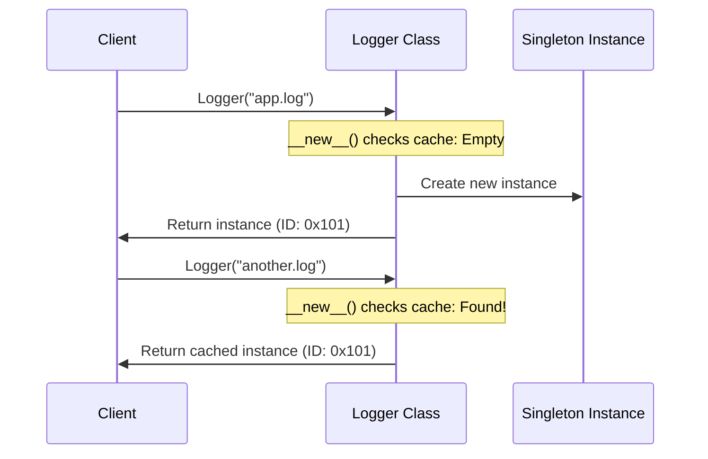

# Singleton Design Pattern

The **Singleton Pattern** is a creational design pattern that ensures a class has only one instance while providing a global access point to that instance.

---

## Table of Contents
- [How It Works](#how-it-works)
- [Why Use Singleton?](#why-use-singleton)
- [Implementation Details in Python](#implementation-details-in-python)
  - [The Python Initialization Lifecycle (`__new__` vs `__init__`)](#the-python-initialization-lifecycle-__new__-vs-__init__)
  - [The Re-initialization Bug & The Guard Pattern](#the-re-initialization-bug--the-guard-pattern)
- [Thread Safety (Double-Checked Locking)](#thread-safety-double-checked-locking)
- [Usage Examples](#usage-examples)

---

## How It Works

Under standard object instantiation, calling a class constructor always creates a new object in memory. With the Singleton pattern, the class intercepts the creation request and returns a cached reference to the single existing instance.



---

## Why Use Singleton?

### Advantages
- **Shared Resource Access**: Ensures coordinated access to shared resources (e.g., database connection pools, configuration managers, or loggers).
- **Memory Efficiency**: Avoids creating duplicate overhead by sharing a single instance across the entire application lifetime.
- **Strict Control**: Prevents clients from bypassing the single-instance rule, ensuring state consistency.

### Disadvantages / Anti-Pattern Considerations
- **Global State**: Can introduce hidden dependencies, making unit testing harder (state carries over between tests).
- **Concurrency Bottlenecks**: Multi-threaded access needs careful locking, which can impact performance.

---

## Implementation Details in Python

### The Python Initialization Lifecycle (`__new__` vs `__init__`)

When you instantiate a class in Python (e.g., `log = Logger()`), Python invokes two primary dunder methods:
1. `__new__(cls, *args, **kwargs)`: Allocates memory and returns a new object instance.
2. `__init__(self, *args, **kwargs)`: Initializes the fields of the newly created instance.

In Python, **`__init__` is always called automatically after `__new__` returns the instance**, regardless of whether that instance is a newly created one or a cached one.

### The Re-initialization Bug & The Guard Pattern

Because `__init__` runs every time `Logger()` is called, simply returning the cached instance from `__new__` is not enough. If we instantiate the logger a second time, the fields will be overwritten or reset. 

For example, look at this scenario:
```python
log1 = Logger("app.log")      # log1.file_name is "app.log"
log2 = Logger("override.log")  # log1 and log2 now both have "override.log"!
log3 = Logger()                # If default is None, it resets file_name to None!
```

To prevent this re-initialization, we implement a **guard pattern** inside `__init__` by checking for an initialization flag:

```python
def __init__(self, file_name=None):
    # Only initialize attributes on the very first instantiation
    if not hasattr(self, "_initialized"):
        self.file_name = file_name
        self._initialized = True
```

---

## Thread Safety (Double-Checked Locking)

In a multithreaded environment, the standard Singleton implementation is susceptible to race conditions. If two threads enter the instance-checking block at the same time, two distinct instances could be created.

To make the class thread-safe, we use a `threading.Lock` combined with **Double-Checked Locking** to minimize locking overhead:

```python
import threading

class Logger:
    _instance = None
    _lock = threading.Lock()

    def __new__(cls, *args, **kwargs):
        if not cls._instance:  # First check (no lock)
            with cls._lock:    # Acquire lock
                if not cls._instance:  # Second check (safe)
                    cls._instance = super().__new__(cls)
        return cls._instance
```

---

## Usage Examples

Here is the complete thread-safe implementation from [logger.py](file:///D:/distributed-crawler/lld/singleton/logger.py):

```python
import threading

class Logger:
    _instance = None
    _lock = threading.Lock()

    def __new__(cls, *args, **kwargs):
        if cls._instance is None:
            with cls._lock:
                if cls._instance is None:
                    cls._instance = super().__new__(cls)
        return cls._instance

    def __init__(self, file_name=None):
        if not hasattr(self, "_initialized"):
            self.file_name = file_name
            self._initialized = True

    def print_log(self, log: str):
        prefix = f"[{self.file_name}] " if self.file_name else ""
        print(f"{prefix}printing log : {log}")
```
