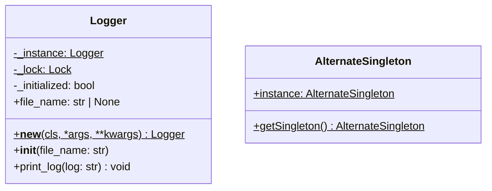
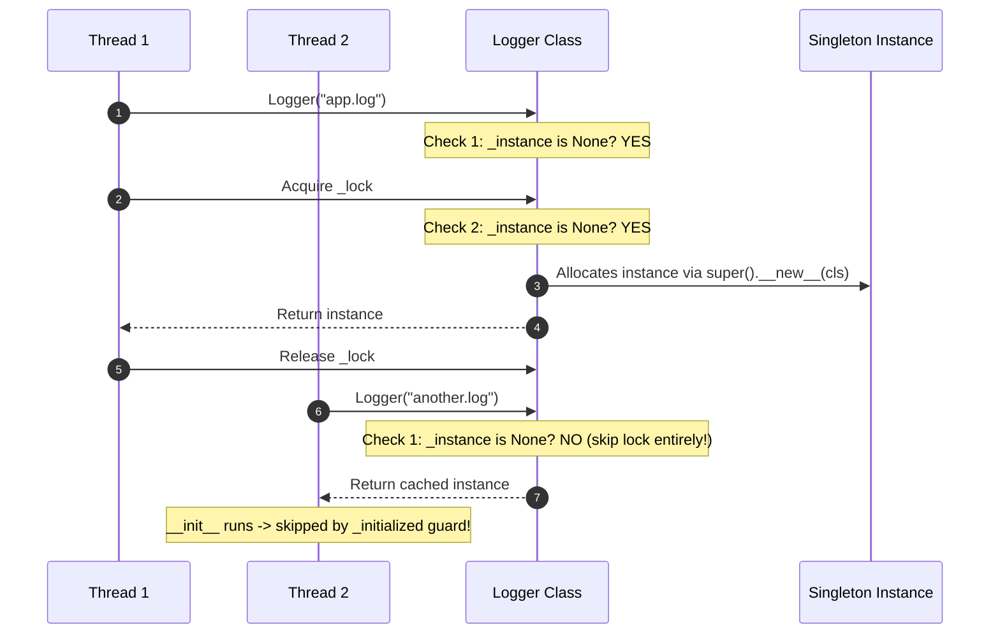

# Singleton Design Pattern - Learning & Revision Guide

The **Singleton Pattern** is a creational design pattern that ensures a class has only one instance in memory while providing a global point of access to that instance.

---

## 💡 Core Concept

Think of a **country's official Central Bank or the President**:
- A country can have many government departments, commercial banks, and citizens, but there is only **one Central Bank** issuing currency and setting interest rates.
- No matter where you are in the country, whenever you refer to the Central Bank, you are pointing to that single, authoritative institution.

> [!NOTE]
> **Key Rule of Thumb in Python:** 
> In Python, `__init__` is called *every time* `Class()` is invoked, even when `__new__` returns an existing instance from cache. To prevent re-initialization from overriding existing state, you **must use an initialization guard flag**!

---

## 🛠️ The Problem & Solution

### The Problem (Multiple Instances & State Desynchronization)
Suppose you have a [Logger](file:///D:/distributed-crawler/lld/singleton/logger.py#L25) or Database Connection Pool.
- If every module creates its own instance (`logger = Logger()`), multiple file handles are opened to the same log file on disk, resulting in file write contention, data interleaving, and memory waste.
- If multiple threads instantiate the class concurrently without synchronization, race conditions can cause multiple instances to be created in memory.
- If subsequent instantiations pass different parameters (`log2 = Logger("override.log")`), a naive implementation would overwrite the existing configuration!

### The Solution (Double-Checked Locking + Init Guard)
1. **Intercept Object Creation:** Override `__new__` to intercept memory allocation and return a cached `_instance`.
2. **Double-Checked Locking:** Use a `threading.Lock` to ensure only one thread can instantiate the object, while checking `_instance is None` both before and after acquiring the lock to maintain high performance.
3. **Initialization Guard:** Inside `__init__`, check `if not hasattr(self, "_initialized"):` to ensure constructor setup logic runs only once.

---

## 📊 Design & Architecture

### UML Class Diagram


```mermaid
classDiagram
    class Logger {
        -_instance: Logger$
        -_lock: Lock$
        -_initialized: bool
        +file_name: str | None
        +__new__(cls, *args, **kwargs) Logger$
        +__init__(file_name: str)
        +print_log(log: str) void
    }

    class AlternateSingleton {
        +instance: AlternateSingleton$
        +getSingleton() AlternateSingleton$
    }
```

### Double-Checked Locking Lifecycle Diagram


```mermaid
sequenceDiagram
    autonumber
    participant T1 as Thread 1
    participant T2 as Thread 2
    participant Logger as Logger Class
    participant Inst as Singleton Instance

    T1->>Logger: Logger("app.log")
    Note over Logger: Check 1: _instance is None? YES
    T1->>Logger: Acquire _lock
    Note over Logger: Check 2: _instance is None? YES
    Logger->>Inst: Allocates instance via super().__new__(cls)
    Logger-->>T1: Return instance
    T1->>Logger: Release _lock

    T2->>Logger: Logger("another.log")
    Note over Logger: Check 1: _instance is None? NO (skip lock entirely!)
    Logger-->>T2: Return cached instance
    Note over T2: __init__ runs -> skipped by _initialized guard!
```

---

## 🔍 Code Walkthrough

This repository provides two implementations demonstrating different trade-offs:

### 1. Production Thread-Safe Singleton ([logger.py](file:///D:/distributed-crawler/lld/singleton/logger.py))
- **`_instance` & `_lock`** ([lines 27-28](file:///D:/distributed-crawler/lld/singleton/logger.py#L27-L28)): Class variables shared across all callers.
- **[__new__](file:///D:/distributed-crawler/lld/singleton/logger.py#L30)**: Implements Double-Checked Locking:
  ```python
  def __new__(cls, *args, **kwargs):
      if cls._instance is None:       # 1st check: Avoid lock overhead once created
          with cls._lock:             # Acquire lock for thread safety
              if cls._instance is None:  # 2nd check: Guard against racing threads
                  cls._instance = super().__new__(cls)
      return cls._instance
  ```
- **[__init__](file:///D:/distributed-crawler/lld/singleton/logger.py#L39)**: Guarded initialization:
  ```python
  def __init__(self, file_name=None):
      if not hasattr(self, "_initialized"):
          self.file_name = file_name
          self._initialized = True
  ```
- **[print_log](file:///D:/distributed-crawler/lld/singleton/logger.py#L46)**: Method utilizing the singleton state.

### 2. Static Method Class Variable Singleton ([other_way.py](file:///D:/distributed-crawler/lld/singleton/other_way.py))
A simpler, classical approach common in Java/C++ style code:
- [Singleton](file:///D:/distributed-crawler/lld/singleton/other_way.py#L4) with class variable `instance = None`.
- [getSingleton()](file:///D:/distributed-crawler/lld/singleton/other_way.py#L8): Static factory method checking `if Singleton.instance is None:` and instantiating on demand.
- *Note:* While simpler, it is not thread-safe without locks and does not prevent callers from directly calling `Singleton()`.

---

## 💻 Example Usage Code

From [logger.py](file:///D:/distributed-crawler/lld/singleton/logger.py#L52):

```python
from logger import Logger

if __name__ == "__main__":
    # 1. Initialize the singleton logger with a file name
    log1 = Logger("app.log")

    # 2. Subsequent instantiations retrieve the exact same instance
    log2 = Logger("override.log")  # Will not overwrite log1's file_name due to initialization guard
    log3 = Logger()

    print("Verifying instance identities:")
    print(f"log1 memory ID: {id(log1)} (file: {log1.file_name})")
    print(f"log2 memory ID: {id(log2)} (file: {log2.file_name})")
    print(f"log3 memory ID: {id(log3)} (file: {log3.file_name})")
    print(f"Are log1 and log2 identical? {log1 is log2}")

    print("\nTesting logging:")
    log1.print_log("First log message.")
    log2.print_log("Second log message from another reference.")
```

### Expected Output
```text
Verifying instance identities (should all be the same memory address):
log1 ID: 2198765432160 (File Name: app.log)
log2 ID: 2198765432160 (File Name: app.log)
log3 ID: 2198765432160 (File Name: app.log)
Are log1 and log2 identical? True

Testing printing capability:
[app.log] printing log : First log message.
[app.log] printing log : Second log message from another reference.
```

---

## 🧠 Revision Cheat-Sheet

> [!TIP]
> In Python, Python modules themselves are singletons by default (cached in `sys.modules`). Importing a module-level variable is often the most Pythonic singleton of all!

### 🌟 Key Design Principles Met
1. **Instance Control:** Strict guarantee of exactly one instance in memory.
2. **Thread Safety:** Double-Checked Locking eliminates race condition hazards.
3. **Global Access Point:** Any component can access the singleton without passing it through deep dependency chains.

### ⚖️ Trade-offs
| Pros ✅ | Cons ❌ |
| :--- | :--- |
| **Controlled Access:** Guaranteed single instance managing shared resources (DB pools, log files). | **Hard to Unit Test:** Global state persists between unit tests, causing test contamination. |
| **Lazy Initialization:** The instance is only allocated when first requested. | **Hidden Dependencies:** Callers instantiate global singletons directly instead of having dependencies passed in via constructors (violates DIP). |
| **Thread-Safe with Double-Checking:** Fast lookups after first creation without continuous lock contention. | **Violates Single Responsibility Principle:** The class solves two problems: business logic AND managing its own lifecycle. |

### 🛠️ Real-world Examples
- **Database Connection Pools:** Managing max connections across multiple web worker threads.
- **Hardware Drivers / Printer Spoolers:** Direct hardware interface requiring exclusive serial port access.
- **Configuration Managers:** Loading `app_settings.json` once into memory and serving it globally.

---

## ❓ Frequently Asked Interview Questions

1. **Why is Double-Checked Locking necessary? Why not just lock the whole method?**
   - Locking every time `Logger()` is called introduces severe synchronization overhead on every read. With double-checked locking, the lock is acquired **only once** during initial creation. All subsequent calls return the cached instance immediately without acquiring the lock.

2. **Why does Python need an initialization guard in `__init__` for Singletons?**
   - In Python, `__call__` on a metaclass invokes `__new__` and then immediately invokes `__init__` on the returned instance. Even if `__new__` returns the existing singleton, Python automatically executes `__init__`, which would overwrite existing state without the guard.

3. **What are the alternatives to implementing a Singleton class in Python?**
   - **Module-level Singleton:** Define variables and functions inside a module (`config.py`). When imported, Python caches the module in `sys.modules`.
   - **Metaclass Singleton:** Create a `SingletonMeta(type)` and set `metaclass=SingletonMeta`.
   - **Dependency Injection:** Pass a single instance down to constructors rather than having classes instantiate singletons globally.

---

## 🚀 How to Run the Example

Run either implementation from the workspace root:

```bash
# 1. Thread-safe Double-Checked Locking Logger
python singleton/logger.py

# 2. Class Variable Static Method Demo
python singleton/other_way.py
```
