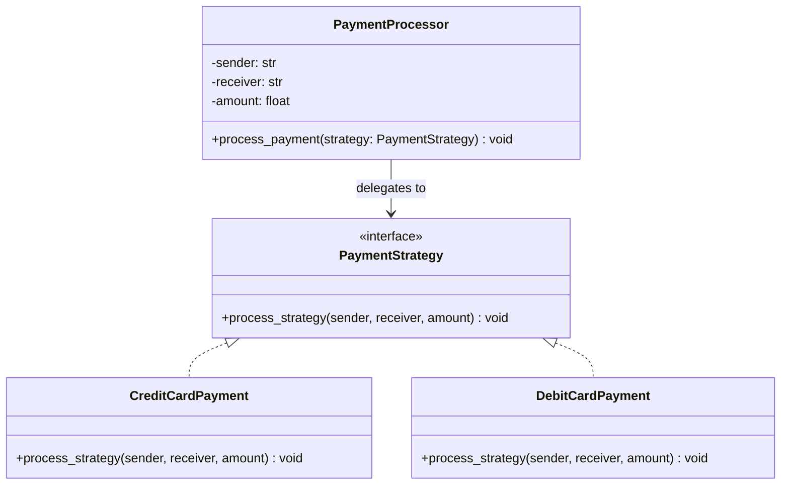

# Strategy Pattern

The **Strategy Pattern** is a behavioral design pattern that lets you define a family of algorithms, put each of them into a separate class (Strategy), and make their objects interchangeable. 

This pattern allows the algorithm to vary independently from the clients that use it.

---

## Pattern Overview

The Strategy Pattern is typically used when you have multiple ways to perform a specific task (like processing a payment, sorting data, or compressing files) and want to decide which method to use at runtime.

### Participants

1. **Strategy Interface** ([PaymentStrategy](file:///D:/distributed-crawler/lld/strategy/payment_strategy.py)): Common interface implemented by all concrete algorithms. It declares the method (`process_strategy`) that the Context uses.
2. **Concrete Strategies** ([CreditCardPayment](file:///D:/distributed-crawler/lld/strategy/credit_card.py) & [DebitCardPayment](file:///D:/distributed-crawler/lld/strategy/debit_card.py)): Concrete implementations of the Strategy interface, containing the specific algorithms.
3. **Context** ([PaymentProcessor](file:///D:/distributed-crawler/lld/strategy/payment_processor.py)): Configured with a Concrete Strategy object and maintains a reference to it. It delegates the execution of the algorithm to the strategy object via the Strategy interface.
4. **Client** ([main.py](file:///D:/distributed-crawler/lld/strategy/main.py)): Instantiates the Context and configures it with the desired Strategy at runtime.

---

## Architecture & Class Diagram

The following Mermaid diagram shows the relationship between our classes:



### Flow of Execution

1. The **Client** ([main.py](file:///D:/distributed-crawler/lld/strategy/main.py)) creates an instance of the **Context** ([PaymentProcessor](file:///D:/distributed-crawler/lld/strategy/payment_processor.py)) with transaction details (sender, receiver, amount).
2. The **Client** invokes `process_payement` on the Context, passing in a **Concrete Strategy** (such as `CreditCardPayment`).
3. The **Context** delegates the execution to the strategy by calling `payment_strategy.process_strategy(...)`.
4. The **Concrete Strategy** executes its specific logic and outputs the result.

---

## Key Benefits

- **Open/Closed Principle**: You can introduce new payment strategies (e.g., `PaypalPayment`, `CryptoPayment`) without altering the `PaymentProcessor` or any existing strategy classes.
- **Runtime Swapability**: The client can decide dynamically at runtime which payment method to apply by passing different strategy instances.
- **Decoupled Algorithms**: Keeps execution details isolated within individual concrete classes, making them easier to unit test and maintain.

---

## How to Run the Example

Run the main file from the root directory of the workspace:

```bash
python strategy/main.py
```
