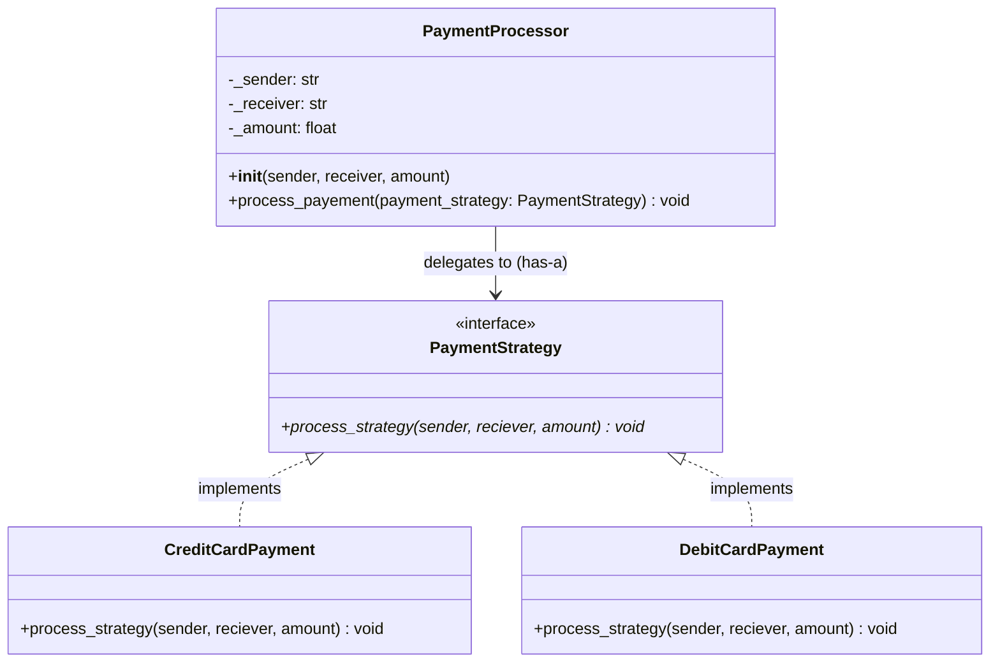
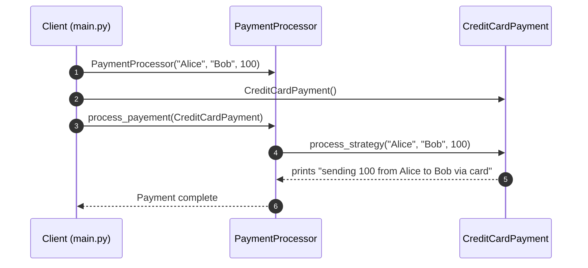

# Strategy Design Pattern - Learning & Revision Guide

The **Strategy Pattern** is a behavioral design pattern that lets you define a family of interchangeable algorithms, encapsulate each one inside a separate class, and make their objects interchangeable at runtime. It allows the algorithm to vary independently from clients that use it.

---

## 💡 Core Concept

Think of **navigating to an airport on Google Maps**:
- You can reach the airport by multiple transit strategies: **Driving a Car**, **Taking the Train / Metro**, **Riding a Bicycle**, or **Walking**.
- Google Maps (the **Context**) knows your origin and destination. It delegates the route and time calculation to whichever **Transit Strategy** you tap on the screen.
- You can switch from Car to Train at any moment, and the app recalculates using the selected strategy without redesigning the map.

> [!NOTE]
> **Key Rule of Thumb:** 
> - **Identify the aspect of your code that varies** (the algorithm) and separate it from what stays the same (the context).
> - **Favor composition over inheritance:** The Context *has-a* Strategy rather than inheriting from multiple algorithm subclasses.

---

## 🛠️ The Problem & Solution

### The Problem (Conditional Spaghetti Code)
Imagine a [PaymentProcessor](file:///D:/distributed-crawler/lld/strategy/payment_processor.py#L3) that needs to handle multiple payment methods (Credit Card, Debit Card, PayPal, Crypto):
- If implemented using conditional branches inside a single class:
  ```python
  class PaymentProcessor:
      def process_payment(self, method_type, amount):
          if method_type == "credit_card":
              # 50 lines of credit card payment gateway logic
          elif method_type == "debit_card":
              # 40 lines of debit card processing logic
          elif method_type == "paypal":
              # ...
  ```
- **Violates Open-Closed Principle (OCP):** Adding a new payment method requires modifying `PaymentProcessor` and adding another `elif` branch.
- **High Risk of Regressions:** Modifying one payment method can accidentally introduce bugs into another payment method within the same file.
- **Difficult Testing:** Testing one algorithm requires instantiating the entire processor with all its dependencies.

### The Solution (Encapsulated Strategy Family)
1. Define a common interface ([PaymentStrategy](file:///D:/distributed-crawler/lld/strategy/payment_strategy.py#L3)) declaring `process_strategy(sender, receiver, amount)`.
2. Extract each payment algorithm into its own dedicated class ([CreditCardPayment](file:///D:/distributed-crawler/lld/strategy/credit_card.py#L3), [DebitCardPayment](file:///D:/distributed-crawler/lld/strategy/debit_card.py#L3)).
3. [PaymentProcessor](file:///D:/distributed-crawler/lld/strategy/payment_processor.py#L3) accepts a `PaymentStrategy` object and delegates the execution to it.

---

## 📊 Design & Architecture

### UML Class Diagram


```mermaid
classDiagram
    class PaymentStrategy {
        <<interface>>
        +process_strategy(sender, reciever, amount)* void
    }

    class CreditCardPayment {
        +process_strategy(sender, reciever, amount) void
    }

    class DebitCardPayment {
        +process_strategy(sender, reciever, amount) void
    }

    class PaymentProcessor {
        -_sender: str
        -_receiver: str
        -_amount: float
        +__init__(sender, receiver, amount)
        +process_payement(payment_strategy: PaymentStrategy) void
    }

    PaymentStrategy <|.. CreditCardPayment : implements
    PaymentStrategy <|.. DebitCardPayment : implements
    PaymentProcessor --> PaymentStrategy : delegates to (has-a)
```

### Sequence Flow Diagram


```mermaid
sequenceDiagram
    autonumber
    participant Client as Client (main.py)
    participant Context as PaymentProcessor
    participant Strategy as CreditCardPayment

    Client->>Context: PaymentProcessor("Alice", "Bob", 100)
    Client->>Strategy: CreditCardPayment()
    Client->>Context: process_payement(CreditCardPayment)
    Context->>Strategy: process_strategy("Alice", "Bob", 100)
    Strategy-->>Context: prints "sending 100 from Alice to Bob via card"
    Context-->>Client: Payment complete
```

---

## 🔍 Code Walkthrough

The strategy implementation consists of:

1. **Strategy Interface**: [PaymentStrategy](file:///D:/distributed-crawler/lld/strategy/payment_strategy.py#L3)
   Defines the abstract method [process_strategy()](file:///D:/distributed-crawler/lld/strategy/payment_strategy.py#L10) ensuring all payment mechanisms follow the same signature.
2. **Concrete Strategies**:
   - [CreditCardPayment](file:///D:/distributed-crawler/lld/strategy/credit_card.py#L3): Implements processing via credit card.
   - [DebitCardPayment](file:///D:/distributed-crawler/lld/strategy/debit_card.py#L3): Implements processing via debit card.
3. **The Context**: [PaymentProcessor](file:///D:/distributed-crawler/lld/strategy/payment_processor.py#L3)
   Maintains transaction details (`sender`, `receiver`, `amount`). The method [process_payement()](file:///D:/distributed-crawler/lld/strategy/payment_processor.py#L14) delegates actual execution to the injected strategy.
4. **Client Runner**: [main.py](file:///D:/distributed-crawler/lld/strategy/main.py#L42)
   Configures the context and dynamically executes transactions with different payment strategies.

---

## 💻 Example Usage Code

From [main.py](file:///D:/distributed-crawler/lld/strategy/main.py):

```python
from payment_processor import PaymentProcessor
from credit_card import CreditCardPayment
from debit_card import DebitCardPayment

if __name__ == "__main__":
    # Initialize the Context with transaction details
    processor = PaymentProcessor("Alice", "Bob", 100)

    # Execute payment using Credit Card strategy
    print("--- Executing Credit Card Payment ---")
    processor.process_payement(CreditCardPayment())

    # Dynamically swap to Debit Card strategy
    print("--- Executing Debit Card Payment ---")
    processor.process_payement(DebitCardPayment())
```

### Expected Output
```text
--- Executing Credit Card Payment ---
sending 100 from Alice to Bob via card
--- Executing Debit Card Payment ---
process 100 from Alice to Bob via debit card
```

---

## 🧠 Revision Cheat-Sheet

> [!TIP]
> Use Strategy when you have multiple variants of an algorithm, or when you find yourself writing large `if/elif/else` or `switch` statements based on an operation type.

### 🌟 Key Design Principles Met
1. **Open-Closed Principle (OCP):** You can introduce new algorithms (e.g. `CryptoPayment`, `ApplePay`) without altering the context or existing strategies.
2. **Single Responsibility Principle (SRP):** Each strategy class isolates the logic and dependencies of its specific algorithm.
3. **Composition Over Inheritance:** Context delegates behavior to strategy objects instead of inheriting algorithm variations.

### ⚖️ Trade-offs
| Pros ✅ | Cons ❌ |
| :--- | :--- |
| **Runtime Algorithm Swapping:** Clients can swap algorithms dynamically during program execution. | **Client Must Know Strategies:** Clients must understand how strategies differ to select the right one. |
| **Eliminates Conditionals:** Eliminates fragile `if-elif-else` branching logic. | **Object Overhead:** Increases the total number of classes and objects in the system. |
| **Isolated Unit Testing:** Each algorithm can be tested independently without instantiating context dependencies. | **Overkill for Static Logic:** If an algorithm never changes or has only one variant, Strategy adds needless boilerplate. |

### 🛠️ Real-world Examples
- **Sorting Algorithms:** Python's `sorted(iterable, key=lambda x: ...)` where `key` is a strategy function.
- **Compression Libraries:** Choosing compression algorithm dynamically (`GzipCompressionStrategy`, `ZstandardCompressionStrategy`).
- **Validation Rules:** Form validation engines applying different validation rules (`EmailValidation`, `PasswordStrengthValidation`).

---

## ❓ Frequently Asked Interview Questions

1. **What is the difference between Strategy and State Pattern?**
   - **Strategy:** The client usually chooses and configures the strategy explicitly. Strategies are independent and unaware of each other.
   - **State:** States can transition from one state to another automatically inside the state classes based on context triggers.

2. **Can Strategies be passed as functions instead of classes in Python?**
   - Yes! Because functions are first-class citizens in Python, you can often pass a callable (function or lambda) directly instead of defining full classes with interfaces. Using classes is preferred when the strategy needs to hold internal state or multiple methods.

3. **How does Strategy compare to Template Method?**
   - **Strategy** is based on *composition*: it alters parts of the object's behavior by delegating to different strategy objects.
   - **Template Method** is based on *inheritance*: it alters parts of an algorithm by subclassing and overriding abstract steps.

---

## 🚀 How to Run the Example

Run the main file from the workspace root:

```bash
python strategy/main.py
```
