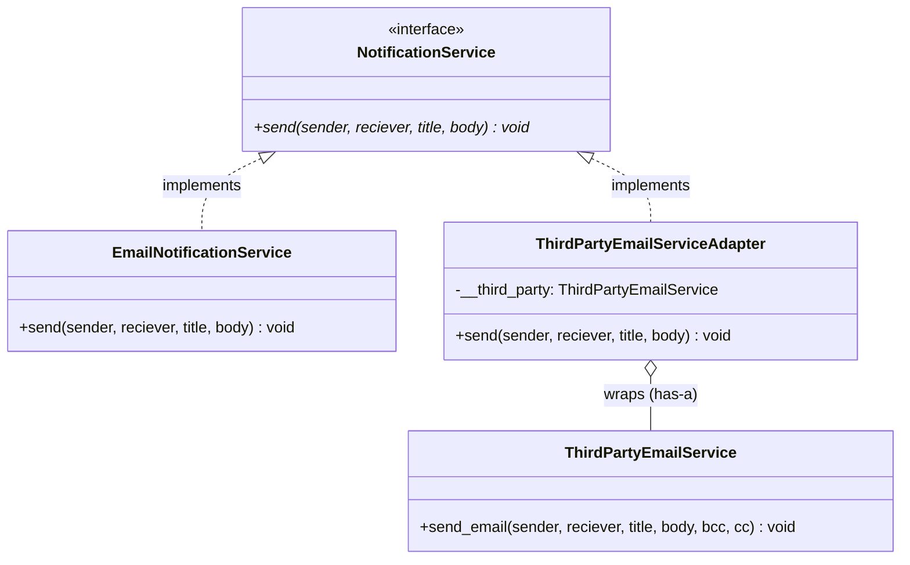
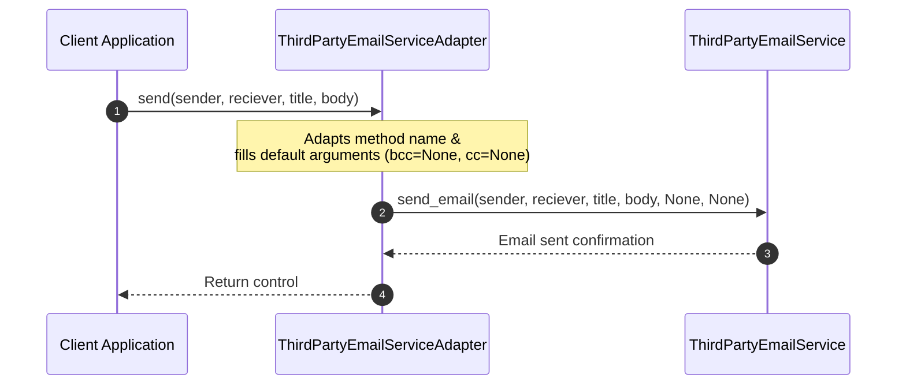

# Adapter Design Pattern - Learning & Revision Guide

The **Adapter Pattern** is a structural design pattern that allows objects with incompatible interfaces to collaborate. It acts as a wrapper or translator between two different interfaces, enabling them to work together without modifying their existing source code.

---

## 💡 Core Concept

Think of an Adapter like a **physical travel power plug adapter**. 

When you travel from the US to the UK, your laptop's two-prong US plug cannot fit into the three-prong UK wall outlet. You don't rebuild your laptop's power supply or rewire the hotel wall. Instead, you plug your laptop into a compact travel adapter that fits the UK wall socket and translates the connection.

> [!NOTE]
> **Key Rule of Thumb:** 
> - **Adapter** converts an **existing incompatible interface** to match what the client expects.
> - Always favor **Object Adapter (composition)** over **Class Adapter (multiple inheritance)** to keep coupling low.

---

## 🛠️ The Problem & Solution

### The Problem (Incompatible Third-Party APIs)
Suppose your application has an in-house notification system built around an interface expecting:
`send(sender, reciever, title, body)`

Later, the team decides to integrate a high-performance external third-party provider ([ThirdPartyEmailService](file:///D:/distributed-crawler/lld/structural/adapter/adapter.py#L28)). However, their SDK defines a different method signature:
`send_email(sender, reciever, title, body, bcc, cc)`

If you change your entire codebase to call `send_email(...)` directly:
1. You violate the **Open-Closed Principle** by modifying working client code across multiple services.
2. Your codebase becomes tightly coupled to this specific third-party library vendor.
3. If you ever switch vendors again, you must rewrite calls everywhere.

### The Solution (Wrapper Adapter)
Create an adapter class ([ThirdPartyEmailServiceAdapter](file:///D:/distributed-crawler/lld/structural/adapter/adapter.py#L33)) that implements your internal [NotificationService](file:///D:/distributed-crawler/lld/structural/adapter/adapter.py#L17) interface and wraps an instance of the third-party service ([ThirdPartyEmailService](file:///D:/distributed-crawler/lld/structural/adapter/adapter.py#L28)).

When the client calls `send(...)`, the adapter intercepts the call, maps the parameters, provides default values for missing fields (such as `bcc=None`, `cc=None`), and forwards the call to `send_email(...)`.

---

## 📊 Design & Architecture

### UML Class Diagram (Object Adapter)



### Sequence Flow Diagram



---

## 🔍 Code Walkthrough

The implementation in [adapter.py](file:///D:/distributed-crawler/lld/structural/adapter/adapter.py) contains:

1. **Target Interface**: [NotificationService](file:///D:/distributed-crawler/lld/structural/adapter/adapter.py#L17)
   Abstract Base Class defining the expected contract: `send(self, sender, reciever, title, body)`.
2. **Concrete Target**: [EmailNotificationService](file:///D:/distributed-crawler/lld/structural/adapter/adapter.py#L23)
   Standard in-house service implementing the target interface.
3. **Adaptee**: [ThirdPartyEmailService](file:///D:/distributed-crawler/lld/structural/adapter/adapter.py#L28)
   The external service that contains the desired business capability but with an incompatible method signature `send_email`.
4. **Adapter**: [ThirdPartyEmailServiceAdapter](file:///D:/distributed-crawler/lld/structural/adapter/adapter.py#L33)
   Inherits from [NotificationService](file:///D:/distributed-crawler/lld/structural/adapter/adapter.py#L17) and takes [ThirdPartyEmailService](file:///D:/distributed-crawler/lld/structural/adapter/adapter.py#L28) in its constructor. Translates calls seamlessly.

---

## 💻 Example Usage Code

From [adapter.py](file:///D:/distributed-crawler/lld/structural/adapter/adapter.py#L41):

```python
from adapter import EmailNotificationService, ThirdPartyEmailService, ThirdPartyEmailServiceAdapter

def main():
    # 1. Using standard in-house service
    ens = EmailNotificationService()
    ens.send("sender@app.com", "user@app.com", "Welcome", "Hello User!")

    # 2. Using third-party service via the Adapter
    tps = ThirdPartyEmailService()
    adapter = ThirdPartyEmailServiceAdapter(tps)
    
    # Client calls the standard target interface transparently
    adapter.send("sender@app.com", "user@app.com", "Notice", "System update tonight.")

if __name__ == "__main__":
    main()
```

### Expected Output
```text
print called email notif service sender@app.com , user@app.com , Welcome , Hello User!
called adapter
called third party email service sender@app.com , user@app.com , Notice , System update tonight. , None , None
```

---

## 🧠 Revision Cheat-Sheet

> [!TIP]
> Use the Adapter Pattern when you want to use an existing class, but its interface does not match the one your application expects.

### 🌟 Key Design Principles Met
1. **Single Responsibility Principle (SRP):** Translating parameters and bridging interfaces is completely separated from core business domain logic.
2. **Open-Closed Principle (OCP):** You can integrate new third-party services by introducing new adapters without breaking existing clients.
3. **Favor Composition over Inheritance:** The Object Adapter uses composition (`has-a`), which keeps dependencies loose and allows adapting any subclass of the adaptee.

### ⚖️ Trade-offs
| Pros ✅ | Cons ❌ |
| :--- | :--- |
| **Interface Compatibility:** Allows legacy or third-party classes to work with modern code without edits. | **Code Overhead:** Increases overall complexity by adding extra classes and interfaces. |
| **Reusability:** Existing third-party libraries and components can be reused seamlessly. | **Indirection Cost:** Slightly introduces a layer of indirection for method delegation. |
| **Vendor Independence:** Changing vendors only requires replacing the adapter, leaving business logic intact. | **Refactoring Alternative:** If you own both classes, directly refactoring the source code might sometimes be cleaner. |

### 🛠️ Real-world Examples
- **Database Drivers (DB-API / JDBC):** Python's `sqlite3`, `psycopg2`, and `mysql-connector` all adapt vendor-specific protocols to standard DB-API interfaces (`connect()`, `cursor()`, `execute()`).
- **Payment Gateways:** Adapting PayPal, Stripe, and Razorpay SDKs to a single internal `PaymentGateway` interface.
- **Logging Adapters:** Python's `logging.LoggerAdapter` adds contextual information (like request IDs) to logging calls.

---

## ❓ Frequently Asked Interview Questions

1. **What is the difference between Object Adapter and Class Adapter?**
   - **Object Adapter** uses *composition*: the adapter holds an instance of the Adaptee. It works with the Adaptee and any of its subclasses.
   - **Class Adapter** uses *multiple inheritance*: the adapter inherits from both Target and Adaptee classes. It cannot adapt subclasses of the Adaptee easily.

2. **How does the Adapter pattern differ from the Decorator and Facade patterns?**
   - **Adapter** converts an existing interface to a *different* interface to make incompatible components collaborate.
   - **Decorator** enhances or adds new responsibilities to an object while keeping the *same* interface.
   - **Facade** provides a *simplified, high-level* interface to a complex subsystem of many classes.

3. **Can an Adapter perform data transformation or parameter conversions?**
   - Yes, absolutely. In real-world adapters, translating data formats (e.g. JSON to XML, converting date formats, or mapping currency values) is one of the primary duties of the adapter.

---

## 🚀 How to Run the Example

Run the script from the workspace root:

```bash
python structural/adapter/adapter.py
```
