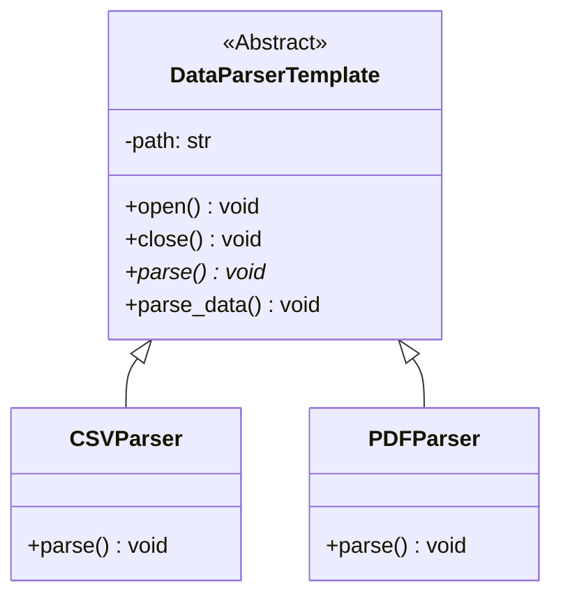

# Template Method Design Pattern

The **Template Method** is a behavioral design pattern that defines the skeleton of an algorithm in the superclass but lets subclasses override specific steps of the algorithm without changing its structure.

---

## Intent & Overview

In software development, we often encounter scenarios where multiple classes share a nearly identical sequence of steps, but differs in how one or more individual steps are performed. 

Instead of duplicating the overarching workflow across all classes, the Template Method pattern:
1. Puts the shared structure (the skeleton of the algorithm) into a single base method (the **Template Method**).
2. Defers specific details to subclasses by calling **abstract/primitive operations** inside the template method.

---

## Class Diagram



---

## Project Structure & Implementation

Our implementation contains:
- `DataParserTemplate` (Abstract Base Class): Defines the general data parsing workflow: `open()` -> `parse()` -> `close()`.
  - `open()` and `close()` are concrete operations shared by all parsers.
  - `parse()` is an abstract/primitive operation that each parser subclass must implement.
  - `parse_data()` is the **Template Method** itself, orchestrating the sequence of operations.
- `CSVParser` & `PDFParser` (Concrete Classes): Specialize the template by implementing only the parsing logic.

### Core Code Snippet (`template.py`)

```python
class DataParserTemplate(ABC):

    def __init__(self, path: str):
        self._path = path

    @abstractmethod
    def parse(self):
        """Must be implemented by subclasses."""
        pass

    def open(self):
        print(f"concrete implementation of open file: {self._path}")

    def close(self):
        print(f"concrete implementation of close file: {self._path}")

    def parse_data(self):
        """The Template Method defining the algorithm skeleton."""
        self.open()
        self.parse()
        self.close()
```

---

## Pros and Cons

| Pros | Cons |
| :--- | :--- |
| **Code Reuse**: Eliminates duplicate code by pulling the common skeleton up to a superclass. | **Rigidity**: Subclasses are bound by the template method's order/structure. |
| **Control**: Subclasses can only change specific parts of the algorithm, leaving the core intact. | **Maintenance**: If the algorithm steps change, the superclass and all subclasses must be updated. |
| **Inversion of Control**: The parent class calls subclass operations (the "Hollywood Principle": *Don't call us, we'll call you*). | **Complexity**: Too many abstract/hook methods can make code navigation harder. |
